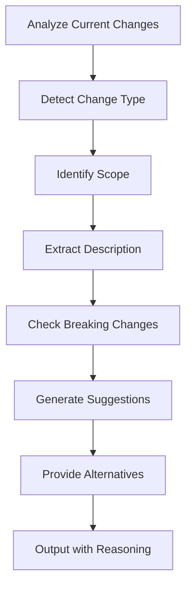

# Commit Suggestion Command

Analyze current changes and suggest appropriate branch name and commit message following [Conventional Commits v1.0.0](https://www.conventionalcommits.org/en/v1.0.0/) specification.

## Core Purpose

Generate professional, semantic commit messages and branch names that:

- Follow Conventional Commits specification strictly
- Enable automated CHANGELOG generation
- Facilitate semantic versioning
- Communicate change nature clearly
- Support automated tooling

## Process Flow



## Analysis Steps

### Step 1: Gather Context

**Analyze multiple sources:**

1. **Git Status:**

   - Modified files
   - Added files
   - Deleted files
   - Renamed files

2. **File Patterns:**

   - `backend/` → backend scope
   - `frontend/` → frontend scope
   - `docs/` → docs scope
   - `tests/` → tests scope
   - `.ai/agents/` → agents scope
   - `stories/` → stories scope

3. **Story Context (if available):**

   - Current story being implemented
   - Task descriptions
   - Requirements being fulfilled

4. **User-Provided Context:**
   - Optional argument with change description
   - Story references
   - Feature explanations

### Step 2: Determine Change Type

**Apply Conventional Commits types:**

| Type       | When to Use               | Example                                               |
| ---------- | ------------------------- | ----------------------------------------------------- |
| `feat`     | New feature added         | `feat(auth): add OAuth2 authentication`               |
| `fix`      | Bug fix                   | `fix(api): prevent race condition in request handler` |
| `docs`     | Documentation only        | `docs(readme): update installation instructions`      |
| `style`    | Code style/formatting     | `style(backend): apply black formatting`              |
| `refactor` | Code refactoring          | `refactor(db): simplify query builder`                |
| `perf`     | Performance improvement   | `perf(api): optimize database queries`                |
| `test`     | Adding/updating tests     | `test(auth): add E2E tests for login flow`            |
| `chore`    | Maintenance tasks         | `chore(deps): update FastAPI to 0.116.2`              |
| `build`    | Build system/dependencies | `build(docker): update base image`                    |
| `ci`       | CI/CD configuration       | `ci(github): add automated tests workflow`            |
| `revert`   | Revert previous commit    | `revert: revert feat(auth): add OAuth2`               |

**Detection heuristics:**

- **New files in `src/`, `app/`, `components/`** → `feat`
- **Modified files with bug fix keywords** → `fix`
- **Only documentation files changed** → `docs`
- **Only test files changed** → `test`
- **Only formatting/style changes** → `style`
- **Dependency updates** → `chore(deps)` or `build(deps)`
- **Mixed changes** → suggest multiple options

### Step 3: Identify Scope

**Auto-detect scope from file paths:**

```python
# Scope detection logic
file_path_to_scope = {
    "backend/": "backend",
    "frontend/": "frontend",
    "backend/app/api/": "api",
    "backend/app/core/db.py": "db",
    "backend/app/auth/": "auth",
    "docs/": "docs",
    "tests/": "tests",
    ".ai/agents/": "agents",
    "stories/": "stories",
    "Makefile": "build",
    "docker-compose.yml": "docker",
    ".github/workflows/": "ci"
}
```

**Scope priority:**

1. **Single obvious scope** → use it
2. **Multiple related scopes** → use broader scope (e.g., `backend` instead of `api,db,auth`)
3. **Cross-cutting changes** → omit scope or use generic scope
4. **Story context available** → use story-related scope

### Step 4: Extract Description

**Create clear, concise description:**

**Rules:**

- Start with lowercase verb (imperative mood)
- No period at the end
- Be specific but concise
- Max 50 characters for branch, 72 for commit header

**Examples:**

✅ **Good:**

- `add user authentication with OAuth2`
- `fix race condition in document sync`
- `update installation instructions`
- `optimize database query performance`

❌ **Bad:**

- `Added authentication` (wrong tense)
- `Fix.` (period at end)
- `Changes` (too vague)
- `This commit adds a completely new feature for user authentication using OAuth2 protocol with JWT tokens` (too long)

### Step 5: Detect Breaking Changes

**Check for breaking changes:**

- API endpoint removals or modifications
- Database schema changes requiring migration
- Configuration changes breaking existing setups
- Dependency major version updates
- Function signature changes in public APIs

**If breaking change detected:**

```
feat(api)!: remove deprecated v1 endpoints

BREAKING CHANGE: v1 API endpoints have been removed.
Migrate to v2 endpoints documented in API guide.
```

### Step 6: Generate Suggestions

**Provide 3 suggestions (if multiple valid options):**

#### Branch Name Suggestions

**Format:** `{type}/{scope}-{description}` or `{type}/{description}`

```
Option 1 (Primary):
  Branch: feat/auth-add-oauth2-authentication
  Reason: Most specific scope based on file changes

Option 2 (Alternative):
  Branch: feat/backend-add-oauth2-authentication
  Reason: Broader scope if changes span multiple auth components

Option 3 (Fallback):
  Branch: feat/add-oauth2-authentication
  Reason: No scope if cross-cutting concern
```

#### Commit Message Suggestions

**Format:**

```
<type>[optional scope]: <description>

[optional body]

[optional footer(s)]
```

**Primary Suggestion:**

```
feat(auth): add OAuth2 authentication with Twitter provider

Implement OAuth2 flow following RFC 6749 with:
- Authorization code grant type with PKCE
- State parameter for CSRF protection
- Nonce verification for ID tokens
- Token refresh mechanism
- Session management with Redis

Closes #42
Refs: stories/user-authentication/design.md
```

**Alternative Suggestion:**

```
feat(backend): add OAuth2 authentication

Implement complete authentication flow with Twitter OAuth2 provider
including token management and session storage.
```

**Minimal Suggestion:**

```
feat(auth): add OAuth2 authentication
```

### Step 7: Provide Reasoning

**Explain suggestion logic:**

```markdown
## Analysis Summary

**Changes Detected:**

- 5 new files in `backend/app/auth/`
- 2 modified files in `backend/app/api/`
- 3 new test files in `tests/integration/`

**Story Context:**

- Current story: `user-authentication`
- Implementing task: 2.1 (OAuth2 integration)

**Type Selection:** `feat`

- New functionality added (authentication system)
- Not a bug fix or refactoring

**Scope Selection:** `auth`

- Primary changes in auth module
- Alternative: `backend` (broader scope)

**Breaking Changes:** None detected

- New feature, no existing functionality removed

## Recommendations

1. Use **Option 1** if this is standalone auth feature
2. Use **Option 2** if part of larger backend refactoring
3. Include **body** to explain OAuth2 specifics
4. Add **Refs:** to link story documentation
```

## Output Format

**Present suggestions clearly:**

```markdown
## 🌿 Branch Name Suggestions

### Primary Recommendation

`feat/auth-add-oauth2-authentication`

### Alternatives

- `feat/backend-add-oauth2-authentication` (broader scope)
- `feat/add-oauth2-authentication` (no scope)

---

## 💬 Commit Message Suggestions

### Primary Recommendation

```
feat(auth): add OAuth2 authentication with Twitter provider

Implement OAuth2 flow following RFC 6749 with:

- Authorization code grant type with PKCE
- State parameter for CSRF protection
- Nonce verification for ID tokens
- Token refresh mechanism
- Session management with Redis

Closes #42
Refs: stories/user-authentication/design.md
```

### Minimal Version (if body not needed)

```
feat(auth): add OAuth2 authentication
```

---

## 📊 Analysis

**Files Changed:** 10 (5 new, 3 modified, 2 tests)
**Primary Scope:** auth
**Story Context:** user-authentication (Task 2.1)
**Breaking Changes:** None

**Reasoning:**
New authentication functionality warrants `feat` type. Primary changes
in auth module suggest `auth` scope. No breaking changes detected.
Story context confirms this implements planned authentication feature.

---

## 📝 Conventional Commits Reference

- Type: `feat` = New feature
- Scope: `(auth)` = Authentication module
- Description: Imperative mood, lowercase, no period
- Body: Detailed explanation (optional but recommended)
- Footer: Issue references, breaking changes

Learn more: https://www.conventionalcommits.org/en/v1.0.0/
```

## Special Cases

### Multiple Unrelated Changes

**Suggest splitting commits:**

```markdown
⚠️ **Warning:** Detected unrelated changes

**Changes in different scopes:**

- Authentication implementation (backend/app/auth/)
- Documentation updates (docs/)
- Dependency updates (backend/requirements.txt)

**Recommendation:**
Split into separate commits:

1. `feat(auth): add OAuth2 authentication`
2. `docs: update API documentation`
3. `chore(deps): update FastAPI to 0.116.2`

This improves git history clarity and simplifies rollbacks.
```

### Work in Progress

**Suggest WIP pattern:**

```markdown
Branch: wip/auth-oauth2-implementation
Commit: wip: auth OAuth2 implementation (work in progress)

Note: Use `wip:` prefix for incomplete work.
Squash/reword before merging to main.
```

### Revert Commits

**Suggest proper revert format:**

```markdown
Branch: revert/auth-oauth2-feature
Commit: revert: feat(auth): add OAuth2 authentication

This reverts commit 676104e.

Reason: OAuth2 implementation causing production issues.
Will re-implement with additional testing.
```

## Quality Checklist

Before suggesting, verify:

- [ ] Type matches actual change nature
- [ ] Scope accurately reflects modified areas
- [ ] Description is clear and concise (<72 chars)
- [ ] Branch name follows kebab-case convention
- [ ] Breaking changes properly flagged
- [ ] Body adds value (not just repeating header)
- [ ] Footers include relevant references
- [ ] Follows Conventional Commits v1.0.0 strictly

## Integration with Development Workflow

**When to use this command:**

1. **Before creating branch:**

   ```bash
   /commit-suggest "Implementing OAuth2 authentication"
   # Use suggested branch name
   git checkout -b feat/auth-add-oauth2-authentication
   ```

2. **Before committing:**

   ```bash
   /commit-suggest
   # Use suggested commit message
   git commit -m "feat(auth): add OAuth2 authentication"
   ```

3. **During story implementation:**
   ```bash
   /commit-suggest "Story: user-authentication, Task: 2.1"
   # Automatically includes story context
   ```

## Usage Examples

```bash
# No arguments - analyze git status automatically
/commit-suggest

# With context description
/commit-suggest "Added OAuth2 authentication with Twitter provider"

# With story reference
/commit-suggest "story:user-authentication task:2.1"

# For documentation changes
/commit-suggest "Updated API documentation with new endpoints"

# For bug fixes
/commit-suggest "Fixed race condition in document sync"

# For breaking changes
/commit-suggest "Removed deprecated v1 API endpoints"
```

## Critical Reminders

1. **Follow Conventional Commits v1.0.0** - strict compliance
2. **Imperative mood** - "add", not "added" or "adds"
3. **Lowercase description** - no capitalization
4. **No period at end** - of header description
5. **Breaking changes** - use `!` or footer
6. **Scope optional** - but recommended when clear
7. **Body optional** - but valuable for complex changes
8. **Reference issues/stories** - in footers

## Success Criteria

Suggestion is successful when:

- ✅ Follows Conventional Commits specification exactly
- ✅ Type accurately represents change nature
- ✅ Scope clearly identifies affected area
- ✅ Description is clear and concise
- ✅ Branch name is valid and readable
- ✅ Breaking changes properly detected and flagged
- ✅ Story context integrated when available
- ✅ Multiple options provided with reasoning
- ✅ Output is copy-paste ready
- ✅ Helps maintain clean git history

Remember: Good commit messages enable automated tooling, clear communication, and maintainable history. This command helps enforce best practices consistently.
