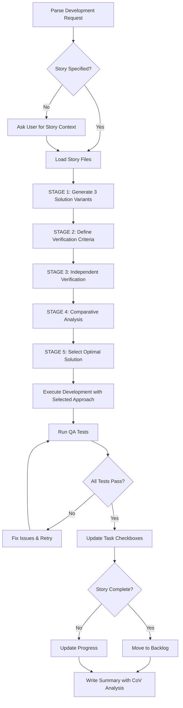

# Development with Chain-of-Verification (CoV)

Implement features using Chain-of-Verification methodology: generate multiple solution variants, independently verify each against criteria, and select the optimal approach through systematic comparison.

## Chain-of-Verification Workflow



## CoV Methodology Overview

**Core Principle:** Generate multiple solution variants → Verify independently → Select optimal approach

**Benefits:**

- Reduces architectural "hallucinations" (suboptimal design choices)
- Ensures systematic consideration of trade-offs
- Provides documented rationale for architectural decisions
- Improves solution quality through comparative analysis

**Key Difference from Standard Development:**

- Standard: Generate one solution → Implement → Fix if issues
- CoV: Generate 3 solutions → Verify independently → Select best → Implement

## STAGE 1: Solution Variant Generation

**After loading story context (design.md, requirements.md, tasks.md):**

### 1.1 Generate Three Distinct Architectural Approaches

For the current task, generate **3 fundamentally different** implementation approaches:

**Variant A: [Approach Name]**

```yaml
Philosophy: [Core architectural philosophy]
Key Components:
  - Component 1: [Purpose and responsibility]
  - Component 2: [Purpose and responsibility]
  - Component 3: [Purpose and responsibility]
Data Flow: [How data flows through the system]
Technology Choices: [Specific tech stack decisions]
Integration Points: [How it connects to existing code]
```

**Variant B: [Alternative Approach Name]**

```yaml
Philosophy: [Different architectural philosophy]
Key Components:
  - Component 1: [Purpose and responsibility]
  - Component 2: [Purpose and responsibility]
  - Component 3: [Purpose and responsibility]
Data Flow: [Different data flow pattern]
Technology Choices: [Alternative tech stack decisions]
Integration Points: [Different integration strategy]
```

**Variant C: [Third Approach Name]**

```yaml
Philosophy: [Third architectural philosophy]
Key Components:
  - Component 1: [Purpose and responsibility]
  - Component 2: [Purpose and responsibility]
  - Component 3: [Purpose and responsibility]
Data Flow: [Third data flow pattern]
Technology Choices: [Third tech stack option]
Integration Points: [Third integration strategy]
```

**Variant Diversity Requirements:**

- Each variant must differ in **core architectural pattern**
- Each variant must use **different data flow strategies**
- Each variant must have **different trade-off profiles**

**Examples of Architectural Diversity:**

| Feature           | Variant A                       | Variant B                  | Variant C                         |
| ----------------- | ------------------------------- | -------------------------- | --------------------------------- |
| API Endpoint      | RESTful with repository pattern | GraphQL with resolvers     | Event-driven with CQRS            |
| Real-Time Updates | SSE with Redis pub/sub          | WebSocket with direct push | Polling with incremental updates  |
| Caching Strategy  | Write-through cache             | Cache-aside pattern        | No cache (query optimization)     |
| Authentication    | OAuth2 with JWT                 | Session-based with Redis   | Token-based with refresh rotation |

## STAGE 2: Verification Criteria Definition

**Define systematic verification questions for each variant:**

### 2.1 Requirements Compliance Criteria

**Question Set 1: EARS Requirements Mapping**

- Q1.1: Does this variant implement all REQ-IDs from requirements.md?
- Q1.2: Are functional requirements (ubiquitous, state-driven, event-driven) satisfied?
- Q1.3: Are non-functional requirements (performance, security) addressed?

### 2.2 Architectural Alignment Criteria

**Question Set 2: Project Architecture Compliance**

- Q2.1: Does this variant enforce project isolation (project_id filtering)?
- Q2.2: Does this variant follow schema-driven patterns (Pydantic → OpenAPI)?
- Q2.3: Does this variant comply with DDD + Hexagonal architecture?
- Q2.4: Does this variant maintain SSE streaming where required?
- Q2.5: Does this variant include OpenTelemetry observability?

### 2.3 Quality Attributes Criteria

**Question Set 3: Non-Functional Quality**

- Q3.1: Performance - What is estimated P95 latency? Does it meet SLO?
- Q3.2: Scalability - How does it scale with data growth (10x, 100x)?
- Q3.3: Maintainability - How complex is the code? Coupling level?
- Q3.4: Testability - Can it be tested in isolation? Mock complexity?
- Q3.5: Security - Are there security vulnerabilities or weaknesses?

### 2.4 Implementation Complexity Criteria

**Question Set 4: Development Effort**

- Q4.1: How many agents need to be activated? (tech-backend, tech-frontend, etc.)
- Q4.2: How many files need to be created/modified?
- Q4.3: What is the estimated implementation time (story points)?
- Q4.4: Are there dependencies on external systems or teams?
- Q4.5: What is the risk of implementation failure?

### 2.5 Technical Debt Criteria

**Question Set 5: Long-Term Impact**

- Q5.1: Does this introduce technical debt? If so, what kind?
- Q5.2: How easy is it to extend or modify in the future?
- Q5.3: Does it create coupling that limits flexibility?
- Q5.4: Are there better alternatives that should be considered for v2?

## STAGE 3: Independent Verification (Factored Verification)

**For EACH variant, answer ALL verification questions independently:**

### Verification Template for Each Variant

```markdown
## Verification Results: Variant [A/B/C]

### Requirements Compliance

- Q1.1: [YES/NO] - [Evidence/Explanation]
- Q1.2: [YES/NO] - [Evidence/Explanation]
- Q1.3: [YES/NO] - [Evidence/Explanation]

### Architectural Alignment

- Q2.1: [YES/NO] - [Evidence/Explanation]
- Q2.2: [YES/NO] - [Evidence/Explanation]
- Q2.3: [YES/NO] - [Evidence/Explanation]
- Q2.4: [YES/NO] - [Evidence/Explanation]
- Q2.5: [YES/NO] - [Evidence/Explanation]

### Quality Attributes

- Q3.1: [P95: Xms] - [Meets/Exceeds/Fails SLO] - [Explanation]
- Q3.2: [Scale Factor: Nx] - [Explanation]
- Q3.3: [Complexity: Low/Med/High] - [Explanation]
- Q3.4: [Testability: Easy/Medium/Hard] - [Explanation]
- Q3.5: [Security Risk: None/Low/Med/High] - [Explanation]

### Implementation Complexity

- Q4.1: [N agents] - [List agents]
- Q4.2: [N files] - [List key files]
- Q4.3: [N story points] - [Breakdown]
- Q4.4: [Dependencies: List or None]
- Q4.5: [Risk: Low/Med/High] - [Explanation]

### Technical Debt

- Q5.1: [YES/NO] - [Description of debt if any]
- Q5.2: [Extensibility: Easy/Med/Hard] - [Explanation]
- Q5.3: [Coupling: Low/Med/High] - [Explanation]
- Q5.4: [Future considerations]
```

**CRITICAL: Answer questions independently for each variant without comparing to others yet.**

## STAGE 4: Comparative Analysis Matrix

**Create comparison matrix across all criteria:**

```markdown
## Comparative Analysis Matrix

| Criterion                   | Weight   | Variant A | Variant B    | Variant C | Winner |
| --------------------------- | -------- | --------- | ------------ | --------- | ------ |
| **Requirements Compliance** |
| All REQ-IDs implemented     | HIGH     | ✅        | ✅           | ❌        | A, B   |
| Functional requirements     | HIGH     | ✅        | ✅           | ✅        | All    |
| Non-functional requirements | HIGH     | ✅        | ⚠️           | ✅        | A, C   |
| **Architectural Alignment** |
| Project isolation enforced  | CRITICAL | ✅        | ✅           | ✅        | All    |
| Schema-driven patterns      | HIGH     | ✅        | ❌           | ✅        | A, C   |
| DDD + Hexagonal             | MEDIUM   | ✅        | ✅           | ⚠️        | A, B   |
| SSE streaming               | HIGH     | ✅        | ❌           | ✅        | A, C   |
| OpenTelemetry               | MEDIUM   | ✅        | ✅           | ✅        | All    |
| **Quality Attributes**      |
| Performance (P95)           | HIGH     | 120ms ✅  | 80ms ✅      | 200ms ⚠️  | B      |
| Scalability (100x)          | HIGH     | Good      | Excellent    | Fair      | B      |
| Maintainability             | MEDIUM   | High      | Low          | High      | A, C   |
| Testability                 | MEDIUM   | Easy      | Hard         | Easy      | A, C   |
| Security                    | CRITICAL | Secure    | Secure       | Risk ❌   | A, B   |
| **Implementation**          |
| Agent count                 | LOW      | 3 agents  | 5 agents     | 2 agents  | C      |
| Files modified              | LOW      | 15 files  | 25 files     | 10 files  | C      |
| Story points                | MEDIUM   | 8 SP      | 13 SP        | 5 SP      | C      |
| Dependencies                | HIGH     | None      | External API | None      | A, C   |
| Implementation risk         | HIGH     | Low       | High         | Low       | A, C   |
| **Technical Debt**          |
| Introduces debt             | CRITICAL | No ✅     | Yes ❌       | No ✅     | A, C   |
| Extensibility               | MEDIUM   | Easy      | Hard         | Medium    | A      |
| Coupling                    | MEDIUM   | Low       | High         | Low       | A, C   |

### Scoring Summary

**Variant A:**

- CRITICAL criteria: 4/4 ✅
- HIGH criteria: 7/9 ✅
- MEDIUM criteria: 4/5 ✅
- **Total Score: 15/18 (83%)**

**Variant B:**

- CRITICAL criteria: 3/4 ⚠️
- HIGH criteria: 5/9 ⚠️
- MEDIUM criteria: 3/5 ⚠️
- **Total Score: 11/18 (61%)**

**Variant C:**

- CRITICAL criteria: 3/4 ❌
- HIGH criteria: 6/9 ⚠️
- MEDIUM criteria: 4/5 ✅
- **Total Score: 13/18 (72%)**
```

## STAGE 5: Optimal Solution Selection

### 5.1 Decision Framework

**Selection Rules (Priority Order):**

1. **CRITICAL criteria must pass** - Any failure disqualifies variant
2. **HIGH criteria majority** - Variant must pass >70% of HIGH criteria
3. **Total weighted score** - Calculate final score with weights
4. **Risk assessment** - Consider implementation risk vs. benefit

### 5.2 Final Decision Template

```markdown
## Final Solution Decision

### Selected Approach: [Variant Letter] - [Approach Name]

**Decision Rationale:**

- **Why this variant:** [Key strengths that led to selection]
- **Critical criteria:** [All CRITICAL criteria satisfied]
- **High-priority wins:** [Key HIGH criteria advantages]
- **Trade-offs accepted:** [Known limitations accepted]

**Rejected Variants:**

- **Variant [X]:** Rejected because [specific critical/high criterion failures]
- **Variant [Y]:** Rejected because [specific critical/high criterion failures]

**Hybrid Considerations:**

- **Incorporate from Variant [X]:** [Specific aspect to incorporate if any]
- **Incorporate from Variant [Y]:** [Specific aspect to incorporate if any]

**Risk Mitigation:**

- [Risk 1]: [Mitigation strategy]
- [Risk 2]: [Mitigation strategy]

**Success Metrics:**

- [Metric 1]: [Target value]
- [Metric 2]: [Target value]

**Implementation Plan:**

1. [Step 1 with agent]
2. [Step 2 with agent]
3. [Step 3 with agent]
```

### 5.3 Documentation of Decision

**Create ADR (Architecture Decision Record) in `stories/<slug>/`:**

```markdown
# ADR: [Feature Name] Implementation Approach

## Context

[Brief description of the feature and why multiple approaches were considered]

## Decision

Selected Variant [X]: [Approach Name]

## Alternatives Considered

### Variant A: [Name]

- **Pros:** [List]
- **Cons:** [List]
- **Verdict:** [Selected/Rejected - Reason]

### Variant B: [Name]

- **Pros:** [List]
- **Cons:** [List]
- **Verdict:** [Selected/Rejected - Reason]

### Variant C: [Name]

- **Pros:** [List]
- **Cons:** [List]
- **Verdict:** [Selected/Rejected - Reason]

## Consequences

- **Positive:** [List]
- **Negative:** [List]
- **Technical Debt:** [None or description]

## Verification Results

- Requirements Compliance: ✅
- Architectural Alignment: ✅
- Quality Attributes: ✅
- Implementation Risk: Low

## Date

[YYYY-MM-DD]
```

## STAGE 6: Implementation with Selected Approach

**Now proceed with standard development workflow using the selected variant:**

### 6.1 Agent Selection & Execution

Based on selected variant's architecture, activate appropriate agents:

```yaml
Task tool parameters:
- subagent_type: "[agent-type from implementation plan]"
- description: "[Task from selected variant]"
- prompt: """
  Feature: [User's feature description]

  Selected Approach: Variant [X] - [Approach Name]
  Rationale: [Brief rationale from decision]

  Story Context:
  - Location: stories/<slug>/
  - Design: [Key architecture points]
  - Requirements: [REQ-IDs]
  - Current Task: [Task ID]

  Implementation Details from Selected Variant:
  [Paste relevant architecture details from selected variant]

  Acceptance Criteria:
  [From tasks.md]

  Verification:
  [How to confirm completion]
  """
```

### 6.2 Quality Assurance

**After development, invoke QA with CoV context:**

```yaml
Task:
  - subagent_type: "tech-qa"
  - description: "Test implemented feature (CoV-verified approach)"
  - prompt: """
    Test feature: [description]

    CoV Analysis Context:
    - Selected Approach: Variant [X]
    - Expected Performance: [P95 target from verification]
    - Critical Requirements: [List from verification]

    Verify:
    - Functional requirements (REQ-IDs)
    - Performance meets verified targets
    - Architecture matches selected variant
    - Project isolation maintained
    """
```

### 6.3 Progress Tracking with CoV Documentation

```yaml
Task:
  - subagent_type: "tech-pm"
  - description: "Update story progress with CoV analysis"
  - prompt: """
    Update progress for stories/<slug>/:
    - Mark completed task IDs: [list]
    - Test results: [summary]
    - CoV Decision: Variant [X] selected
    - ADR created: stories/<slug>/adr-[feature].md

    Verify story completion and update tracking accordingly.
    """
```

## Usage Examples

```bash
# Basic usage - will ask for story context
/develop-cov "Implement user authentication with OAuth2"

# With story context
/develop-cov "Add document versioning API endpoint" story:document-versioning task:2.1

# Complex feature requiring architectural decision
/develop-cov "Implement real-time collaboration with conflict resolution" story:collaboration

# Full-stack feature with multiple approaches
/develop-cov "Build project dashboard with analytics" story:analytics task:1.1,1.2
```

## Quality Gates (Enhanced with CoV)

Before marking tasks complete, verify:

- [ ] **CoV Analysis completed** - All 3 variants generated and verified
- [ ] **Decision documented** - ADR created with rationale
- [ ] **Selected approach implemented** - Code matches selected variant architecture
- [ ] **Verification criteria met** - All CRITICAL and HIGH criteria satisfied
- [ ] Feature implements requirements from requirements.md
- [ ] Project isolation enforced
- [ ] No fallbacks, mocks, or stubs in production code
- [ ] Schema-driven patterns used
- [ ] Tests written and passing
- [ ] Performance meets verified targets
- [ ] Task acceptance criteria met

## Final Report Template

```markdown
## Development Summary (Chain-of-Verification)

### Story: [Story Name]

**Location:** `stories/<slug>/`

### Chain-of-Verification Analysis

**Variants Generated:**

- Variant A: [Approach Name] - [Brief description]
- Variant B: [Approach Name] - [Brief description]
- Variant C: [Approach Name] - [Brief description]

**Selected Approach:** Variant [X] - [Approach Name]

**Selection Rationale:**

- Critical criteria: 4/4 ✅
- High criteria: 8/9 ✅
- Total score: 85%
- Key advantage: [Main reason]

**Rejected Approaches:**

- Variant [Y]: [Key reason for rejection]
- Variant [Z]: [Key reason for rejection]

**ADR Created:** `stories/<slug>/adr-[feature].md`

### Completed Tasks

- [x] Task X.Y: [Description] - Verified against CoV criteria
- [x] Task X.Z: [Description] - Verified against CoV criteria

### Agents Activated

- tech-backend: Implemented [selected variant architecture]
- tech-frontend: Built UI following [selected variant pattern]
- tech-qa: Verified performance targets from CoV analysis
- tech-pm: Updated progress tracking with ADR

### Test Results

- E2E Tests: X/X passed
- Integration Tests: Y/Y passed
- Unit Tests: Z/Z passed
- **Performance:** P95 = [value] (Target: [target from verification])

### Verification Results

- ✅ Requirements Compliance: All REQ-IDs implemented
- ✅ Architectural Alignment: Follows selected variant exactly
- ✅ Quality Attributes: Performance meets/exceeds targets
- ✅ Implementation Risk: Mitigated as planned

### Story Status

[✅ Complete - Moved to backlog | 🟡 In Progress]

### Files Modified

- backend/app/...
- frontend/src/...
- tests/...
- stories/<slug>/tasks.md
- stories/<slug>/adr-[feature].md (NEW)

### Technical Debt

[None | List with mitigation plan]

### Next Steps

[What should be done next]
```

## Best Practices

1. **Generate diverse variants** - Don't just tweak parameters, use fundamentally different patterns
2. **Independent verification** - Answer verification questions without comparing variants yet
3. **Weight critical criteria** - Security and requirements compliance are non-negotiable
4. **Document decisions** - Always create ADR for CoV decisions
5. **Learn from rejections** - Rejected variants inform future architectural decisions
6. **Hybrid when beneficial** - Don't be afraid to combine best aspects of multiple variants
7. **Iterate if needed** - If all variants fail critical criteria, generate new variants

## Success Criteria

Development with CoV is complete when:

- ✅ Three distinct solution variants generated
- ✅ All verification criteria defined and answered
- ✅ Comparative analysis matrix completed
- ✅ Optimal solution selected with documented rationale
- ✅ ADR created in story folder
- ✅ Implementation matches selected variant architecture
- ✅ All tests passing with verified performance targets
- ✅ Story progress updated with CoV documentation

**Remember:** Chain-of-Verification adds systematic rigor to architectural decisions, ensuring optimal solutions through independent verification and comparative analysis. The extra upfront analysis pays dividends in code quality and long-term maintainability.
