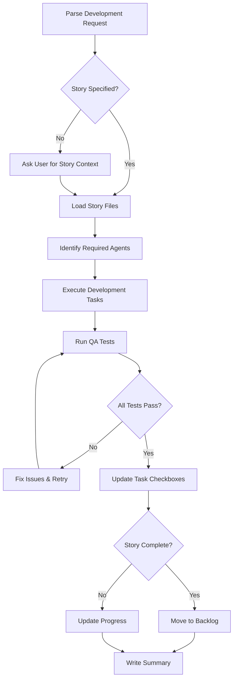

# Development Workflow Command

Implement features by orchestrating specialized development agents, following story-based planning, executing tasks, running tests, and updating progress tracking.

## Core Workflow



## Process Steps

### Step 1: Story Context Discovery

**If story/task NOT specified in prompt:**

Ask user to clarify:

- Which story from `stories/plan.md` are we implementing?
- Which specific task(s) from `stories/<slug>/tasks.md`?
- Is this a new unplanned feature (needs story creation first)?

**If story specified:**

1. Load `stories/<story-slug>/design.md` - understand architecture
2. Load `stories/<story-slug>/requirements.md` - review EARS requirements
3. Load `stories/<story-slug>/tasks.md` - identify current task(s)

### Step 2: Agent Selection Strategy

**Analyze task requirements and select appropriate agents:**

**Backend Development (`tech-backend`):**

- API endpoints and business logic
- FastAPI routes and Pydantic schemas
- SQLAlchemy models and repositories
- OAuth2 authentication
- SSE streaming endpoints
- Agent orchestration

**Frontend Development (`tech-frontend`):**

- React components and pages
- TanStack DB state management
- CSS Modules styling
- API client integration
- Real-time SSE consumers

**Database (`tech-postgres`):**

- Schema design and migrations
- Alembic autogenerate revisions
- Indexes and performance optimization
- Project isolation enforcement

**Caching (`tech-redis`):**

- Cache layer implementation
- Pub/Sub for SSE progress
- Rate limiting per project
- Queue management

**Vector Search (`tech-vector-db`):**

- Qdrant collection setup
- Embedding pipelines
- Semantic search with project isolation
- Payload filtering

**Infrastructure (`tech-devops`):**

- Docker configuration
- Service orchestration
- Environment setup
- Deployment scripts

**Agent Orchestration Patterns:**

```python
# Pattern 1: Sequential (dependencies exist)
# Example: Database schema → Backend models → API endpoints → Frontend UI
1. tech-postgres    # Create tables
2. tech-backend     # Implement models and API
3. tech-frontend    # Build UI components

# Pattern 2: Parallel (independent tasks)
# Example: Backend API + Frontend UI (using existing schema)
[tech-backend, tech-frontend]  # Execute simultaneously

# Pattern 3: Layered (infrastructure → application → presentation)
1. tech-postgres + tech-redis  # Data layer (parallel)
2. tech-backend                # Application layer
3. tech-frontend               # Presentation layer
```

### Step 3: Development Execution

**For each selected agent:**

1. **Pass full context:**

   - Feature description from user prompt
   - Story design and requirements
   - Specific task from tasks.md
   - Dependencies and prerequisites

2. **Agent implements:**

   - Code following their specialized guidelines
   - Tests for their layer
   - Documentation updates

3. **Verify implementation:**

   - Code follows project standards
   - Project isolation maintained
   - No fallbacks or mock data
   - Schema-driven patterns used

### Step 4: Quality Assurance (`tech-qa`)

**After all development agents complete:**

1. **Invoke `tech-qa` agent:**

   ```yaml
   Task:
     - subagent_type: "tech-qa"
     - description: "Test implemented feature"
     - prompt: "Write and execute tests for: [feature description].
         Story: stories/<slug>/,
         Requirements: [list REQ-IDs from requirements.md],
         Verify project isolation and schema compliance."
   ```

2. **QA agent must:**

   - Write appropriate tests (E2E for user flows, integration for APIs, unit for logic)
   - Use data-testid attributes for E2E tests
   - Test project isolation
   - Run all tests and report results

3. **Handle test failures:**

   - If tests fail due to bugs → activate appropriate agent to fix
   - If tests fail due to unimplemented TODOs → skip tests with clear documentation
   - Retry QA after fixes

### Step 5: Progress Tracking (`tech-pm`)

**After successful testing, invoke `tech-pm` agent:**

```yaml
Task:
  - subagent_type: "tech-pm"
  - description: "Update story progress tracking"
  - prompt: "Update progress for stories/<slug>/:
      - Mark completed task IDs: [list]
      - Test results: [summary]
      - Implementation evidence: [details]

      Verify story completion status and update plan.md or move to backlog.md accordingly."
```

**PM agent responsibilities** (details in tech-pm.md):

- Mark completed tasks with `[x]` in tasks.md
- Assess story completion status
- Update plan.md or move story to backlog.md
- Document outcomes and remaining work

### Step 6: Final Report

**Summarize completed work:**

```markdown
## Development Summary

### Story: [Story Name]

**Location:** `stories/<slug>/`

### Completed Tasks

- [x] Task X.Y: [Description] - [Verification method]
- [x] Task X.Z: [Description] - [Verification method]

### Agents Activated

- tech-backend: Implemented API endpoints
- tech-frontend: Built UI components
- tech-qa: Created and ran E2E tests (100% pass)
- tech-pm: Updated progress tracking

### Test Results

- E2E Tests: X/X passed
- Integration Tests: Y/Y passed
- Unit Tests: Z/Z passed

### Story Status

[✅ Complete - Moved to backlog | 🟡 In Progress - N tasks remaining]

### Files Modified

- backend/app/...
- frontend/src/...
- tests/...
- stories/<slug>/tasks.md

### Next Steps

[What should be done next, if story incomplete]
```

## Agent Selection Decision Matrix

| Task Type          | Primary Agent                             | Supporting Agents         | Execution  |
| ------------------ | ----------------------------------------- | ------------------------- | ---------- |
| API Endpoint       | tech-backend                              | tech-postgres (schema)    | Sequential |
| Full-Stack Feature | tech-backend + tech-frontend              | tech-postgres, tech-redis | Layered    |
| Database Schema    | tech-postgres                             | tech-backend (models)     | Sequential |
| UI Component       | tech-frontend                             | -                         | Single     |
| Real-Time Feature  | tech-backend (SSE) + tech-redis (pub/sub) | tech-frontend (consumer)  | Sequential |
| Vector Search      | tech-vector-db                            | tech-backend (API)        | Sequential |
| Infrastructure     | tech-devops                               | All (deployment)          | Single     |
| Authentication     | tech-backend                              | tech-postgres, tech-redis | Sequential |

## Quality Gates (MANDATORY)

Before marking tasks complete, verify:

- [ ] Feature implements requirements from `requirements.md` (REQ-IDs traceable)
- [ ] Project isolation enforced (all operations scoped to project_id)
- [ ] No fallbacks, mocks, or stubs in production code
- [ ] Schema-driven patterns used (Pydantic for API, SQLAlchemy for DB)
- [ ] Tests written and passing (E2E + Integration + Unit)
- [ ] Code follows agent guidelines (see individual agent files)
- [ ] Documentation updated (if applicable)
- [ ] Task acceptance criteria met (verifiable outcomes)

## Story File Integration

**During development, continuously reference:**

1. **design.md** - Architecture decisions, diagrams, component structure
2. **requirements.md** - EARS requirements to implement (REQ-IDs)
3. **tasks.md** - Current task, acceptance criteria, verification steps

**Maintain traceability:**

- Link implemented code to REQ-IDs in requirements.md
- Verify task acceptance criteria from tasks.md
- Update task checkboxes as work completes

## Common Development Patterns

### Pattern 1: New API Endpoint

```text
1. tech-postgres: Create/update schema if needed
2. tech-backend:
   - Define Pydantic models
   - Implement repository (with project_id filtering)
   - Create FastAPI endpoint
   - Add project isolation dependency
3. tech-frontend:
   - Generate TypeScript types from OpenAPI
   - Implement API client
   - Build UI component
4. tech-qa: Write E2E + integration tests
5. tech-pm: Mark tasks complete
```

### Pattern 2: Database-Heavy Feature

```text
1. tech-postgres:
   - Design schema with project_id
   - Create Alembic autogenerate migration
   - Add indexes
2. tech-backend:
   - Create SQLAlchemy models
   - Implement repository layer
   - Build service layer
   - Add API endpoints
3. tech-redis: Add caching layer (optional)
4. tech-qa: Integration tests for data operations
5. tech-pm: Update progress
```

### Pattern 3: Real-Time Feature (SSE)

```text
1. tech-redis: Setup pub/sub channel (proj:{project_id}:progress)
2. tech-backend:
   - Implement SSE endpoint
   - Add progress publishers
3. tech-frontend:
   - Implement SSE hook
   - Update UI on events
4. tech-qa: E2E test for real-time updates
5. tech-pm: Mark complete
```

## Error Handling

**If agent activation fails:**

- Verify correct `subagent_type` used
- Check Task tool parameters
- Retry with corrected parameters

**If implementation violates standards:**

- Reference specific agent file for requirements
- Request agent to fix issues
- Re-run QA after fixes

**If tests fail:**

- Check if feature has TODO markers → skip tests with documentation
- Otherwise, activate appropriate agent to fix bugs
- Re-run tests after fixes

## Usage Examples

```bash
# Specify feature only (will ask for story context)
/develop "Implement user authentication with OAuth2"

# Specify feature with story context
/develop "Add document versioning API endpoint" story:document-versioning task:2.1

# Specify feature with multiple tasks
/develop "Complete data layer for projects" story:project-management task:1.1,1.2,1.3

# Full-stack feature
/develop "Build project creation flow (backend + frontend)" story:project-management
```

## Agent Communication Protocol

When invoking agents, use this structure:

```yaml
Task tool parameters:
- subagent_type: "tech-[backend|frontend|postgres|redis|vector-db|devops|qa|pm]"
- description: "Brief task summary"
- prompt: """
  Feature: [User's feature description]

  Story Context:
  - Location: stories/<slug>/
  - Design: [Key architecture points from design.md]
  - Requirements: [REQ-IDs from requirements.md]
  - Current Task: [Task ID from tasks.md]

  Acceptance Criteria:
  - [From tasks.md]

  Verification:
  - [How to confirm completion]

  [Any additional context or constraints]
  """
```

## Critical Reminders

1. **ALWAYS specify story context** - either from user prompt or by asking
2. **Follow task order** - implement tasks sequentially unless explicitly parallel
3. **Maintain traceability** - link code to REQ-IDs and task IDs
4. **Enforce project isolation** - every agent must filter by project_id
5. **Schema-driven** - no manual duplication (Pydantic → OpenAPI → TypeScript)
6. **Test before complete** - tech-qa MUST validate before marking done
7. **Update tracking** - tech-pm MUST update tasks.md and plan.md/backlog.md
8. **No shortcuts** - follow full workflow even for small tasks

## Success Criteria

Development is complete when:

- ✅ All required agents executed successfully
- ✅ All tests passing (E2E + Integration + Unit)
- ✅ Task checkboxes marked in tasks.md
- ✅ Story status updated in plan.md or moved to backlog.md
- ✅ Code follows all agent guidelines
- ✅ Project isolation verified
- ✅ Traceability maintained (REQ-IDs → code → tests)

Remember: This command orchestrates the complete development lifecycle from implementation through testing to progress tracking. Quality and traceability are non-negotiable.
