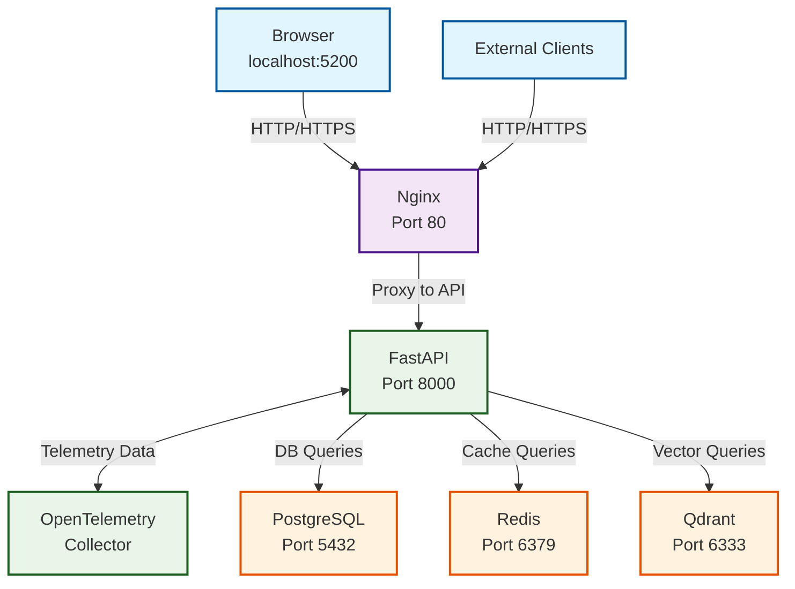

# JEEX Idea Docker Development Environment Setup

This guide explains how to set up and use the JEEX Idea Docker development environment based on the Variant A architecture approach.

## Prerequisites

- Docker Desktop (or Docker Engine) installed
- Docker Compose included with Docker installation
- At least 4GB RAM available for Docker
- Ports 5200-5300 available on your machine

## Quick Start

### 1. Initial Setup

```bash
# Clone the repository (if not already done)
git clone <repository-url>
cd jeex-idea

# Set up project structure and symlinks
make setup

# Set up development environment configuration
make dev-setup

# Generate SSL certificates for development (optional but recommended)
./scripts/setup-dev-ssl.sh
```

### 2. Configure Environment Variables

Edit the `.env` file that was created from the template:

```bash
# Required - Set secure passwords
POSTGRES_PASSWORD=your_secure_postgres_password
JWT_SECRET_KEY=your_jwt_secret_key_minimum_32_characters

# Optional - Configure external services
OPENAI_API_KEY=your_openai_api_key_if_needed
ANTHROPIC_API_KEY=your_anthropic_api_key_if_needed
```

### 3. Start Development Environment

```bash
# Start all services
make dev-up

# Check service status
make dev-status

# View logs
make dev-logs
```

## Service Architecture

The Docker environment follows the Variant A architecture with three isolated networks:

### Networks
- **jeex-frontend**: Frontend-to-backend communication
- **jeex-backend**: Internal service-to-service communication
- **jeex-data**: Database and cache service isolation

### Services

| Service | External Port | Internal Port | Description |
|---------|---------------|---------------|-------------|
| **API** | 5210 | 8000 | FastAPI backend service |
| **PostgreSQL** | 5220 | 5432 | Primary database (v18) |
| **Qdrant** | 5230 | 6333 | Vector database (v1.15.4+) |
| **Redis** | 5240 | 6379 | Cache and queue (v8.2+) |
| **Nginx** | 80/443 | - | Reverse proxy |
| **OpenTelemetry** | 8888 | 4317/4318 | Observability collector |

## Development Workflow

### Common Commands

```bash
# Start environment
make dev-up

# Stop environment
make dev-down

# Restart services
make dev-restart

# View logs for all services
make dev-logs

# View logs for specific service
make dev-logs-service SERVICE=api

# Access API container shell
make dev-shell

# Access specific service shell
make dev-shell-service SERVICE=postgres

# Database operations
make db-shell          # Open PostgreSQL shell
make db-backup         # Create database backup
make db-reset          # Reset database (WARNING: deletes data)
```

### Service URLs

After starting the environment, you can access services at:

- **API**: http://localhost:5210
- **API Documentation**: http://localhost:5210/docs
- **OpenTelemetry Metrics**: http://localhost:8888/metrics
- **Qdrant Web UI**: http://localhost:5230/dashboard

### Database Access

**PostgreSQL Connection:**
- Host: localhost
- Port: 5220
- Database: jeex_idea
- Username: jeex_user
- Password: (from .env file)

**Redis Connection:**
- Host: localhost
- Port: 5240

**Qdrant Connection:**
- Host: localhost
- Port: 5230

## Development Features

### Hot Reload

The API service supports hot reload for rapid development. Changes to the backend code will be automatically reflected without restarting containers.

### Health Monitoring

All services include health checks that verify:
- Service is running and responsive
- Dependencies are available
- Configuration is valid

Health status can be viewed with:
```bash
docker-compose ps
make dev-status
```

### Logging

Structured logging is configured for all services:
- Application logs flow to OpenTelemetry collector
- Container logs are accessible via `docker-compose logs`
- Log levels are configurable via environment variables

### Security Features

- All containers run as non-root users
- Network segmentation prevents unauthorized access
- Resource limits prevent resource exhaustion
- Secrets are managed through environment variables
- TLS termination via Nginx (when SSL certificates are present)

## Configuration

### Environment Variables

Key environment variables in `.env`:

```bash
# Database
POSTGRES_PASSWORD=secure_password

# API Security
JWT_SECRET_KEY=minimum_32_character_secret

# Development Settings
DEBUG=true
LOG_LEVEL=DEBUG

# CORS
FRONTEND_URL=http://localhost:5200

# Performance
DATABASE_POOL_SIZE=10
REDIS_MAX_CONNECTIONS=10
```

### Docker Compose Override

For local customizations, create a `docker-compose.override.yml`:

```yaml
version: '3.8'
services:
  api:
    volumes:
      - ./your-local-path:/app/your-path:delegated
    environment:
      - YOUR_CUSTOM_VAR=value
```

## Troubleshooting

### Port Conflicts

If ports are already in use:
```bash
# Check what's using the ports
lsof -i :5220
lsof -i :5240

# Either stop the conflicting service or change ports in docker-compose.yml
```

### Permission Issues

If you encounter permission errors:
```bash
# Reset permissions on volumes
docker-compose down
docker volume rm jeex-postgres-data jeex-qdrant-data jeex-redis-data
docker-compose up --build
```

### Health Check Failures

If services fail health checks:
```bash
# Check specific service logs
make dev-logs-service SERVICE=postgres

# Check service configuration
docker-compose config

# Restart specific service
docker-compose restart postgres
```

### Performance Issues

If the environment is slow:
1. Increase Docker memory allocation (recommended: 4GB+)
2. Check Docker Desktop resource limits
3. Monitor container resource usage:
   ```bash
   docker stats
   ```

## Data Persistence

Data is persisted across container restarts using named volumes:
- `jeex-postgres-data`: PostgreSQL data
- `jeex-qdrant-data`: Vector database data
- `jeex-redis-data`: Cache data
- `jeex-otel-logs`: OpenTelemetry logs

To backup data:
```bash
# Database backup
make db-backup

# Manual volume backup
docker run --rm -v jeex-postgres-data:/data -v $(pwd):/backup alpine tar czf /backup/postgres-backup.tar.gz -C /data .
```

## Production Considerations

This configuration is optimized for development. For production deployment:

1. Use stronger passwords and secrets
2. Enable SSL/TLS with proper certificates
3. Configure proper backup strategies
4. Set up monitoring and alerting
5. Review and tighten security settings
6. Configure resource limits based on expected load

## Architecture Diagram



## Getting Help

- Check the service logs: `make dev-logs`
- Verify configuration: `docker-compose config`
- Check container status: `docker-compose ps`
- Review environment variables in `.env`

For detailed troubleshooting, see the [Development Troubleshooting Guide](docs/troubleshooting.md).