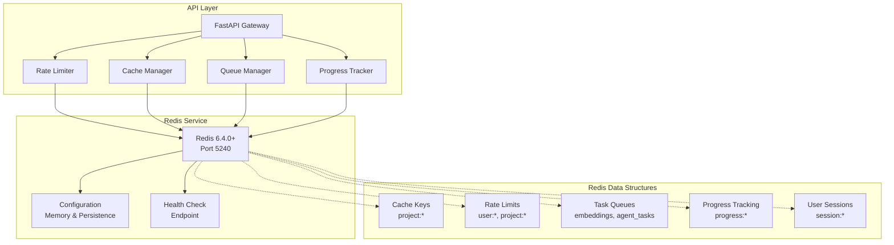
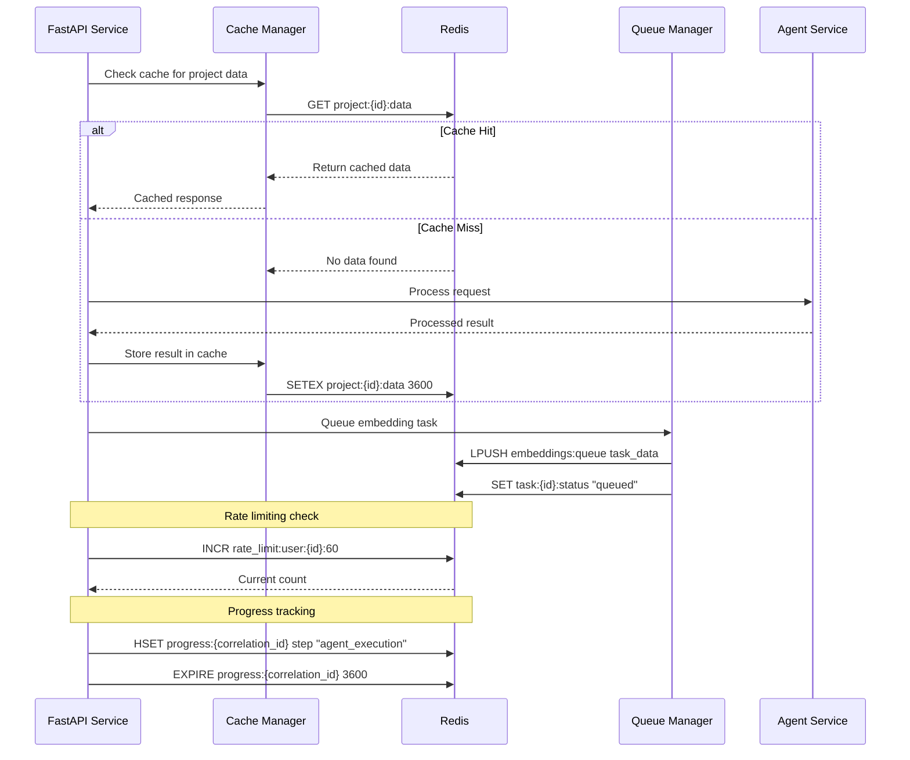
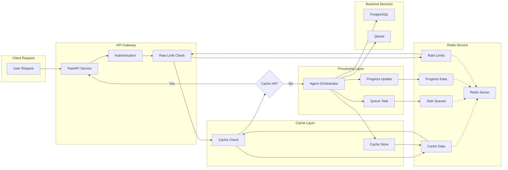

# Design Document — Story "Setup Cache and Queue Service (Redis)"

## Overview

This story focuses on configuring Redis as the cache and queue service for the JEEX Idea system. Redis will provide essential infrastructure for caching, task queuing, rate limiting, and real-time progress tracking. The implementation builds upon the existing Docker environment and integrates with PostgreSQL and Qdrant services.

## Current State Analysis

### Existing Infrastructure

- Docker development environment is operational with all core services
- PostgreSQL database is configured and ready for connections
- Qdrant vector database is operational with project/language isolation
- Basic Redis container exists in docker-compose.yml but lacks detailed configuration

### Current Redis Configuration Gap

- Redis container exists but lacks detailed configuration
- No defined caching strategies or patterns
- No rate limiting implementation
- No queue management for background tasks
- No progress tracking infrastructure for SSE
- No monitoring or health checks specific to Redis

## Proposed Architecture

### Redis Service Architecture



### Cache and Queue Patterns



## Components and Interfaces

### 1. Redis Configuration Service

**Responsibilities:**

- Redis connection management and pooling
- Configuration optimization for JEEX Idea use cases
- Health checks and monitoring integration
- Connection failover and retry logic

**Interface:**

```python
class RedisService:
    def get_connection(self) -> redis.Redis
    def health_check(self) -> bool
    def get_info(self) -> dict
    def close_connections(self) -> None
```

### 2. Cache Manager

**Responsibilities:**

- Project data caching with TTL
- User session management
- Agent response caching
- Query result caching

**Interface:**

```python
class CacheManager:
    def get_project_data(self, project_id: str) -> Optional[dict]
    def set_project_data(self, project_id: str, data: dict, ttl: int = 3600)
    def invalidate_project_cache(self, project_id: str)
    def get_user_session(self, user_id: str) -> Optional[dict]
    def set_user_session(self, user_id: str, session_data: dict, ttl: int = 7200)
```

### 3. Rate Limiter

**Responsibilities:**

- User-level rate limiting
- Project-level rate limiting
- IP-based rate limiting
- Token consumption tracking

**Interface:**

```python
class RateLimiter:
    def check_user_limit(self, user_id: str, window: int, limit: int) -> bool
    def check_project_limit(self, project_id: str, window: int, limit: int) -> bool
    def check_ip_limit(self, ip_address: str, window: int, limit: int) -> bool
    def consume_tokens(self, user_id: str, tokens: int) -> bool
```

### 4. Queue Manager

**Responsibilities:**

- Background task queuing (embeddings, agent tasks)
- Task status tracking
- Priority queue management
- Dead letter queue handling

**Interface:**

```python
class QueueManager:
    def enqueue_task(self, queue_name: str, task_data: dict, priority: int = 0)
    def dequeue_task(self, queue_name: str) -> Optional[dict]
    def get_task_status(self, task_id: str) -> Optional[str]
    def update_task_status(self, task_id: str, status: str)
    def requeue_failed_tasks(self, queue_name: str)
```

### 5. Progress Tracker

**Responsibilities:**

- SSE progress tracking
- Correlation ID management
- Agent execution progress
- Real-time status updates

**Interface:**

```python
class ProgressTracker:
    def start_progress(self, correlation_id: str, total_steps: int)
    def update_progress(self, correlation_id: str, step: int, message: str)
    def get_progress(self, correlation_id: str) -> Optional[dict]
    def complete_progress(self, correlation_id: str)
    def cleanup_expired_progress(self)
```

## Data Models

### Redis Key Patterns

**Cache Keys:**

- `project:{project_id}:data` - Project document cache
- `project:{project_id}:context` - Project context cache
- `user:{user_id}:session` - User session data
- `agent:{agent_type}:config` - Agent configuration cache

**Rate Limit Keys:**

- `rate_limit:user:{user_id}:{window}` - User rate limits
- `rate_limit:project:{project_id}:{window}` - Project rate limits
- `rate_limit:ip:{ip_address}:{window}` - IP rate limits
- `tokens:user:{user_id}:daily` - Daily token consumption

**Queue Keys:**

- `queue:embeddings` - Embedding computation queue
- `queue:agent_tasks` - Agent background tasks
- `queue:exports` - Document export tasks
- `task:{task_id}:status` - Individual task status

**Progress Keys:**

- `progress:{correlation_id}` - Progress tracking data
- `progress:{correlation_id}:steps` - Step-by-step progress
- `sse:{connection_id}` - SSE connection tracking

### Data Structures

**Cache Entry:**

```json
{
  "data": {},
  "created_at": "2025-01-25T10:00:00Z",
  "expires_at": "2025-01-25T11:00:00Z",
  "version": 1
}
```

**Rate Limit Entry:**

```json
{
  "count": 10,
  "window_start": "2025-01-25T10:00:00Z",
  "limit": 100,
  "reset_time": "2025-01-25T11:00:00Z"
}
```

**Task Entry:**

```json
{
  "id": "task_uuid",
  "type": "embedding_computation",
  "data": {},
  "priority": 1,
  "status": "queued",
  "created_at": "2025-01-25T10:00:00Z",
  "attempts": 0,
  "max_attempts": 3
}
```

**Progress Entry:**

```json
{
  "correlation_id": "correlation_uuid",
  "total_steps": 5,
  "current_step": 2,
  "message": "Processing business analyst response",
  "started_at": "2025-01-25T10:00:00Z",
  "updated_at": "2025-01-25T10:05:00Z",
  "estimated_completion": "2025-01-25T10:15:00Z"
}
```

## Error Handling Strategy

### Connection Failures

- Automatic connection retry with exponential backoff
- Circuit breaker pattern for Redis unavailability
- Graceful degradation when Redis is unavailable
- Fallback to direct database queries for critical operations

### Memory Management

- Redis memory monitoring and alerts
- Automatic key eviction policies (LRU)
- Memory usage optimization for large data structures
- Periodic cleanup of expired keys

### Queue Processing Errors

- Dead letter queue for failed tasks
- Automatic retry with exponential backoff
- Task priority adjustment for repeated failures
- Monitoring and alerting for queue backlog

## Architecture Diagrams

### Redis Integration Flow



### Redis Data Organization

```mermaid
graph TB
    subgraph "Redis Memory Structure"
        subgraph "Cache Section"
            PROJ_CACHE[Project Cache<br/>project:*]
            USER_CACHE[User Sessions<br/>session:*]
            AGENT_CACHE[Agent Config<br/>agent:*]
        end

        subgraph "Rate Limit Section"
            USER_RATE[User Limits<br/>rate_limit:user:*]
            PROJ_RATE[Project Limits<br/>rate_limit:project:*]
            IP_RATE[IP Limits<br/>rate_limit:ip:*]
            TOKEN_RATE[Token Usage<br/>tokens:*]
        end

        subgraph "Queue Section"
            EMBED_QUEUE[Embedding Queue<br/>queue:embeddings]
            AGENT_QUEUE[Agent Tasks<br/>queue:agent_tasks]
            EXPORT_QUEUE[Export Tasks<br/>queue:exports]
            TASK_STATUS[Task Status<br/>task:*:status]
        end

        subgraph "Progress Section"
            PROGRESS_DATA[Progress Tracking<br/>progress:*]
            SSE_CONN[SSE Connections<br/>sse:*]
            CORRELATION[Correlation Data<br/>correlation:*]
        end
    end

    PROJ_CACHE --> REDIS_MEMORY[Redis Memory Pool]
    USER_CACHE --> REDIS_MEMORY
    AGENT_CACHE --> REDIS_MEMORY
    USER_RATE --> REDIS_MEMORY
    PROJ_RATE --> REDIS_MEMORY
    IP_RATE --> REDIS_MEMORY
    TOKEN_RATE --> REDIS_MEMORY
    EMBED_QUEUE --> REDIS_MEMORY
    AGENT_QUEUE --> REDIS_MEMORY
    EXPORT_QUEUE --> REDIS_MEMORY
    TASK_STATUS --> REDIS_MEMORY
    PROGRESS_DATA --> REDIS_MEMORY
    SSE_CONN --> REDIS_MEMORY
    CORRELATION --> REDIS_MEMORY
```



## Security Considerations

### Access Control

- Redis AUTH password protection
- Network-level access restrictions
- SSL/TLS encryption for Redis connections
- Connection whitelist for authorized services

### Data Protection

- Sensitive data encryption in Redis
- Automatic key expiration for sensitive data
- Memory sanitization for deleted keys
- Audit logging for Redis operations

### Isolation

- Logical separation of data by project ID
- Key-based access control per project
- Memory quotas per project
- Resource isolation for different data types

## Performance Considerations

### Memory Optimization

- Efficient data structure selection (hashes vs strings)
- Memory usage monitoring and alerts
- Key compression for large values
- Periodic memory cleanup and optimization

### Connection Management

- Connection pooling for API services
- Persistent connections with health checks
- Connection timeout configuration
- Load balancing across multiple Redis instances (future)

### Query Optimization

- Pipeline operations for multiple commands
- Batch operations for bulk data
- Lua scripts for complex operations
- Index optimization for hash fields

## Implementation Sequence

### Phase 1: Redis Configuration and Health Checks

1. Update docker-compose.yml with Redis configuration
2. Configure Redis persistence and memory limits
3. Implement Redis service connection management
4. Create health check endpoints and monitoring
5. Add Redis-specific metrics and logging

### Phase 2: Cache Management Implementation

1. Implement cache manager with key patterns
2. Add project data caching with TTL
3. Implement user session management
4. Add cache invalidation strategies
5. Create cache monitoring and cleanup

### Phase 3: Rate Limiting and Queue Management

1. Implement rate limiting service
2. Create task queue management system
3. Add background task processing
4. Implement priority queues and dead letter handling
5. Add queue monitoring and alerting

### Phase 4: Progress Tracking and Integration

1. Implement progress tracking for SSE
2. Add correlation ID management
3. Integrate with existing API services
4. Add comprehensive testing
5. Performance optimization and tuning

## Traceability Matrix

| Component | Requirements | Test Cases |
|-----------|--------------|------------|
| Redis Configuration | REQ-001, REQ-002 | TC-CONF-001, TC-CONF-002 |
| Cache Manager | REQ-003, REQ-004 | TC-CACHE-001, TC-CACHE-002 |
| Rate Limiter | REQ-005, REQ-006 | TC-RATE-001, TC-RATE-002 |
| Queue Manager | REQ-007, REQ-008 | TC-QUEUE-001, TC-QUEUE-002 |
| Progress Tracker | REQ-009, REQ-010 | TC-PROG-001, TC-PROG-002 |

## Risks & Mitigations

### High-Risk Items

- **Redis Memory Exhaustion**: Implement memory monitoring and automatic eviction policies
- **Connection Failures**: Implement circuit breakers and graceful degradation
- **Queue Backlog**: Implement priority processing and scaling strategies

### Medium-Risk Items

- **Cache Inconsistency**: Implement cache invalidation and versioning
- **Rate Limit Evasion**: Implement multiple rate limiting strategies
- **Performance Bottlenecks**: Implement monitoring and optimization

### Low-Risk Items

- **Configuration Errors**: Implement validation and testing
- **Data Loss**: Implement persistence and backup strategies
- **Security Vulnerabilities**: Implement security best practices and regular updates
