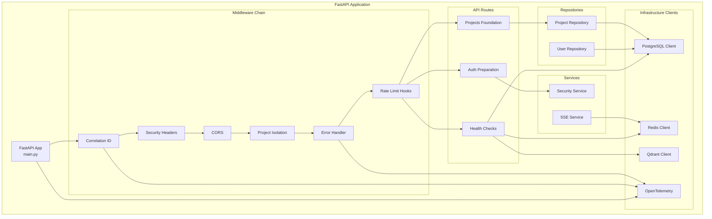
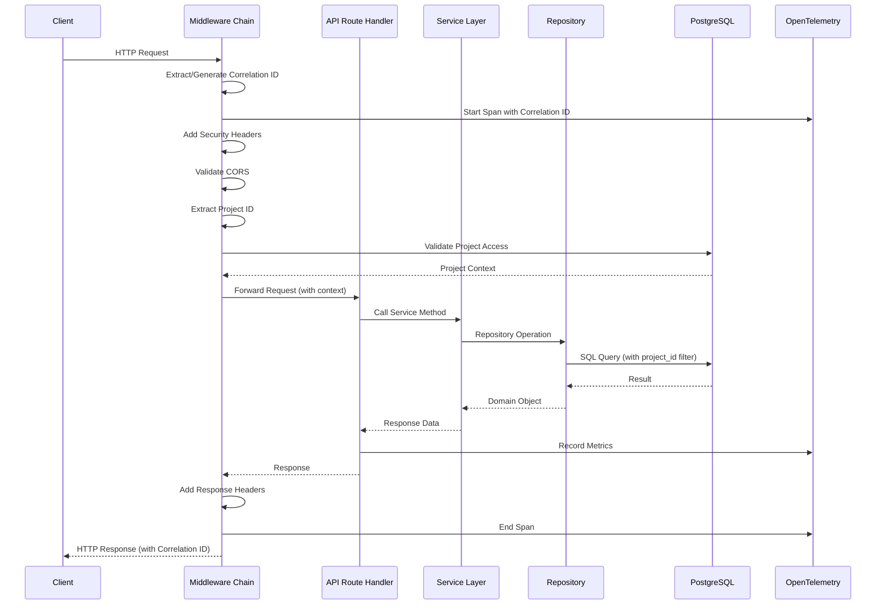
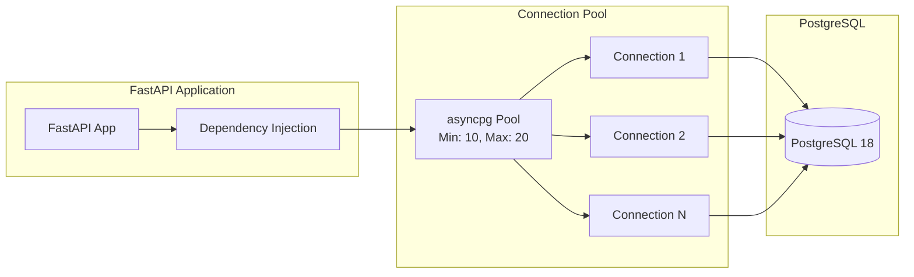
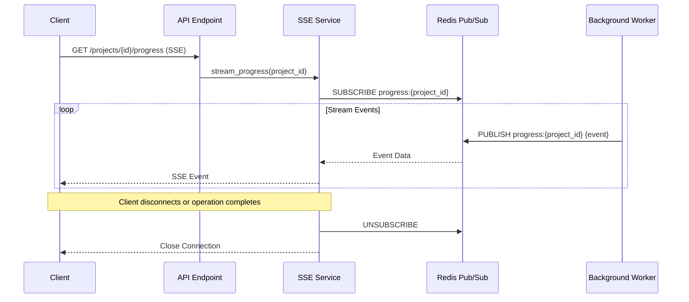

# Design Document — Story "Setup FastAPI Backend Foundation"

## Overview

This story establishes the foundational FastAPI backend service that serves as the core API layer for the JEEX Idea MVP. The backend provides RESTful endpoints, SSE streaming, security middleware, project isolation, and integrates with the existing infrastructure (PostgreSQL, Redis, Qdrant, OpenTelemetry).

**Problem Statement:** The JEEX Idea system requires a production-ready API backend that coordinates all operations, enforces security boundaries, maintains project isolation, and provides real-time updates through SSE streaming.

**Objectives:**

- Create FastAPI 0.119.1+ application structure with async support
- Implement security middleware (authentication preparation, CORS, security headers)
- Establish project isolation middleware for all requests
- Configure OpenTelemetry auto-instrumentation for distributed tracing
- Integrate with PostgreSQL, Redis, and Qdrant services
- Implement health check endpoints for all dependencies
- Setup SSE streaming infrastructure for long-running operations
- Create development server configuration with hot reload

**Scope:**

- FastAPI application structure and configuration
- Middleware layer (security, project isolation, correlation IDs, error handling)
- Database connection management (PostgreSQL, Redis, Qdrant)
- Health check endpoints
- Basic API structure (projects resource foundation)
- OAuth2 preparation (infrastructure only, Twitter integration is Story 18)
- JWT token handling infrastructure
- Rate limiting hooks (implementation details in Story 19)
- SSE streaming infrastructure
- Development server configuration
- OpenTelemetry integration

**Out of Scope (Future Stories):**

- Multi-agent orchestration (Story 7)
- Language detection service (Story 9)
- Response parser service (Story 11)
- Embedding service (Story 12)
- Full API endpoints for idea generation (Story 13)
- Document management system (Story 14)
- Twitter OAuth2 implementation (Story 18)
- Full security implementation (Story 19)

## Current State Analysis

**Existing Infrastructure (Stories 1-5):**

- **Docker Environment:** All services containerized with health checks, networks (jeex-frontend, jeex-backend, jeex-data), and volumes
- **PostgreSQL 18:** Complete schema with users, projects, documents, agent_executions, embeddings, audit logs tables
- **Qdrant 1.15.4+:** Vector database configured with project+language isolation patterns
- **Redis 6.4.0+:** Cache, queue, rate limiting infrastructure ready
- **OpenTelemetry:** Full observability stack with collector, exporters, and correlation ID support

**Gaps to Address:**

- No API service to expose database operations
- No middleware for security and project isolation
- No health check aggregation for infrastructure dependencies
- No SSE streaming infrastructure
- No development server configuration
- No application-level error handling patterns

## Proposed Architecture

The FastAPI backend follows a layered architecture with clear separation of concerns:

**Layer 1: API Gateway (FastAPI Application)**

- Request routing and OpenAPI documentation
- Middleware chain execution
- Response formatting and error handling
- SSE streaming coordination

**Layer 2: Middleware Chain**

- Correlation ID injection (OpenTelemetry context)
- CORS configuration
- Security headers
- Authentication middleware (OAuth2/JWT preparation)
- Project isolation enforcement
- Rate limiting hooks
- Error handling and logging

**Layer 3: Service Layer**

- Business logic orchestration
- Service-to-service communication
- Transaction management
- Event emission for observability

**Layer 4: Repository Layer**

- Database operations (PostgreSQL, Redis, Qdrant)
- Connection pooling management
- Query optimization
- Transaction handling

**Layer 5: Infrastructure Integration**

- PostgreSQL async connection pool (asyncpg)
- Redis async client (aioredis)
- Qdrant async client
- OpenTelemetry instrumentation

**Project Structure:**

```
backend/
├── app/
│   ├── __init__.py
│   ├── main.py                    # FastAPI application factory
│   ├── config.py                  # Configuration management
│   ├── dependencies.py            # Dependency injection
│   │
│   ├── api/
│   │   ├── __init__.py
│   │   ├── v1/
│   │   │   ├── __init__.py
│   │   │   ├── router.py          # v1 API router aggregation
│   │   │   ├── health.py          # Health check endpoints
│   │   │   ├── projects.py        # Projects endpoints (foundation)
│   │   │   └── auth.py            # Auth endpoints (preparation)
│   │
│   ├── middleware/
│   │   ├── __init__.py
│   │   ├── correlation_id.py     # Correlation ID injection
│   │   ├── security.py            # Security headers, CORS
│   │   ├── project_isolation.py  # Project context enforcement
│   │   ├── error_handler.py      # Global error handling
│   │   └── rate_limit.py         # Rate limiting hooks
│   │
│   ├── core/
│   │   ├── __init__.py
│   │   ├── database.py            # PostgreSQL connection
│   │   ├── redis.py               # Redis connection
│   │   ├── qdrant.py              # Qdrant connection
│   │   ├── security.py            # OAuth2/JWT utilities
│   │   ├── telemetry.py           # OpenTelemetry setup
│   │   └── exceptions.py          # Custom exceptions
│   │
│   ├── models/
│   │   ├── __init__.py
│   │   ├── base.py                # Base SQLAlchemy models
│   │   ├── user.py                # User model
│   │   ├── project.py             # Project model
│   │   └── document.py            # Document model
│   │
│   ├── schemas/
│   │   ├── __init__.py
│   │   ├── base.py                # Base Pydantic schemas
│   │   ├── user.py                # User schemas
│   │   ├── project.py             # Project schemas
│   │   ├── health.py              # Health check schemas
│   │   └── common.py              # Common response schemas
│   │
│   ├── repositories/
│   │   ├── __init__.py
│   │   ├── base.py                # Base repository pattern
│   │   ├── user.py                # User repository
│   │   └── project.py             # Project repository
│   │
│   └── services/
│       ├── __init__.py
│       └── sse.py                 # SSE streaming service
│
├── tests/
│   ├── __init__.py
│   ├── conftest.py                # Pytest fixtures
│   ├── test_health.py             # Health check tests
│   └── test_middleware.py         # Middleware tests
│
├── alembic/                        # Existing migrations (Story 2)
├── pyproject.toml                  # Dependency management
├── Dockerfile                      # Production image
└── .env.example                    # Environment variables template
```

## Components and Interfaces

### 1. FastAPI Application (main.py)

**Responsibilities:**

- Application lifecycle management (startup/shutdown)
- Middleware registration
- Router registration
- OpenTelemetry auto-instrumentation
- CORS configuration
- Exception handlers registration

**Public Interface:**

```python
def create_app() -> FastAPI:
    """
    Application factory that creates and configures FastAPI instance.

    Returns:
        Configured FastAPI application
    """
    pass

async def startup_event() -> None:
    """Initialize connections to PostgreSQL, Redis, Qdrant."""
    pass

async def shutdown_event() -> None:
    """Gracefully close all connections."""
    pass
```

### 2. Configuration Management (config.py)

**Responsibilities:**

- Load environment variables
- Validate configuration
- Provide typed configuration objects
- Support multiple environments (dev/stage/prod)

**Public Interface:**

```python
from pydantic_settings import BaseSettings, SettingsConfigDict

class Settings(BaseSettings):
    """Application configuration loaded from environment (Pydantic v2)."""

    # Pydantic v2: Use model_config instead of inner class Config
    model_config = SettingsConfigDict(env_file=".env")

    # Environment
    environment: str = "development"
    debug: bool = False

    # API
    api_host: str = "0.0.0.0"
    api_port: int = 8000
    api_prefix: str = "/api/v1"

    # Security
    secret_key: str
    algorithm: str = "RS256"
    access_token_expire_minutes: int = 30

    # Database
    database_url: str
    database_pool_size: int = 20
    database_max_overflow: int = 10

    # Redis
    redis_url: str
    redis_max_connections: int = 50

    # Qdrant
    qdrant_url: str
    qdrant_collection: str = "jeex_embeddings"

    # OpenTelemetry
    otel_endpoint: str = "http://otel-collector:4317"
    otel_service_name: str = "jeex-api"

    # CORS
    cors_origins: list[str] = ["http://localhost:5200"]

def get_settings() -> Settings:
    """Singleton settings instance."""
    pass
```

### 3. Middleware Components

#### Correlation ID Middleware

**Responsibilities:**

- Extract or generate correlation ID from headers
- Inject into OpenTelemetry context
- Add to response headers

**Interface:**

```python
async def correlation_id_middleware(
    request: Request,
    call_next: Callable
) -> Response:
    """
    Inject correlation ID into request context and response headers.

    Header: X-Correlation-ID
    """
    pass
```

#### Security Middleware

**Responsibilities:**

- Add security headers (HSTS, X-Content-Type-Options, etc.)
- Configure CORS policies
- Content Security Policy headers

**Interface:**

```python
async def security_headers_middleware(
    request: Request,
    call_next: Callable
) -> Response:
    """Add security headers to all responses."""
    pass
```

#### Project Isolation Middleware

**Responsibilities:**

- Extract project_id from URL path or headers
- Validate project access permissions
- Inject project context into request state
- Enforce server-side filtering for database queries

**Interface:**

```python
async def project_isolation_middleware(
    request: Request,
    call_next: Callable
) -> Response:
    """
    Enforce project isolation by extracting and validating project_id.

    Sets: request.state.project_id
    """
    pass
```

#### Error Handler Middleware

**Responsibilities:**

- Catch all exceptions
- Log with correlation ID
- Return standardized error responses
- Preserve stack traces for debugging

**Interface:**

```python
async def error_handler_middleware(
    request: Request,
    call_next: Callable
) -> Response:
    """Global exception handler with structured logging."""
    pass
```

### 4. Database Connection Management

#### PostgreSQL Connection

**Responsibilities:**

- Async connection pool using asyncpg
- Session management
- Transaction handling
- Connection health checks

**Interface:**

```python
class Database:
    """PostgreSQL connection manager."""

    def __init__(self, url: str, pool_size: int, max_overflow: int):
        pass

    async def connect(self) -> None:
        """Initialize connection pool."""
        pass

    async def disconnect(self) -> None:
        """Close connection pool."""
        pass

    async def health_check(self) -> bool:
        """Verify database connectivity."""
        pass

    def get_session(self) -> AsyncSession:
        """Get database session for dependency injection."""
        pass
```

#### Redis Connection

**Responsibilities:**

- Async Redis client using aioredis
- Connection pooling
- Health checks

**Interface:**

```python
class RedisClient:
    """Redis connection manager."""

    def __init__(self, url: str, max_connections: int):
        pass

    async def connect(self) -> None:
        """Initialize Redis connection pool."""
        pass

    async def disconnect(self) -> None:
        """Close Redis connections."""
        pass

    async def health_check(self) -> bool:
        """Verify Redis connectivity."""
        pass

    def get_client(self) -> Redis:
        """Get Redis client for dependency injection."""
        pass
```

#### Qdrant Connection

**Responsibilities:**

- Async Qdrant client
- Collection validation
- Health checks

**Interface:**

```python
class QdrantClient:
    """Qdrant connection manager."""

    def __init__(self, url: str, collection: str):
        pass

    async def connect(self) -> None:
        """Initialize Qdrant client."""
        pass

    async def disconnect(self) -> None:
        """Close Qdrant client."""
        pass

    async def health_check(self) -> bool:
        """Verify Qdrant connectivity and collection existence."""
        pass

    def get_client(self) -> AsyncQdrant:
        """Get Qdrant client for dependency injection."""
        pass
```

### 5. Health Check System

**Responsibilities:**

- Aggregate health status from all dependencies
- Provide liveness and readiness probes
- Return detailed status for debugging

**Interface:**

```python
@router.get("/health/live")
async def liveness() -> dict:
    """
    Liveness probe for Kubernetes.

    Returns 200 if application is running.
    """
    pass

@router.get("/health/ready")
async def readiness(
    db: Database = Depends(get_database),
    redis: RedisClient = Depends(get_redis),
    qdrant: QdrantClient = Depends(get_qdrant)
) -> dict:
    """
    Readiness probe for Kubernetes.

    Returns 200 if all dependencies are healthy.
    """
    pass

@router.get("/health")
async def health_detail(
    db: Database = Depends(get_database),
    redis: RedisClient = Depends(get_redis),
    qdrant: QdrantClient = Depends(get_qdrant)
) -> HealthResponse:
    """
    Detailed health status with dependency checks.

    Returns status for each component.
    """
    pass
```

### 6. SSE Streaming Service

**Responsibilities:**

- Manage SSE connections
- Stream events to clients
- Handle client disconnections
- Provide backpressure control

**Interface:**

```python
class SSEService:
    """Server-Sent Events streaming service."""

    async def stream_progress(
        self,
        project_id: str,
        operation_id: str
    ) -> AsyncGenerator[str, None]:
        """
        Stream progress events for long-running operation.

        Yields SSE formatted events.
        """
        pass

    async def publish_event(
        self,
        project_id: str,
        operation_id: str,
        event: dict
    ) -> None:
        """Publish event to Redis for SSE streaming."""
        pass
```

### 7. OAuth2/JWT Security Infrastructure

**Responsibilities:**

- JWT token creation and validation utilities
- OAuth2 password bearer scheme setup
- Token dependency for protected routes

**Interface:**

```python
class SecurityService:
    """OAuth2 and JWT utilities."""

    def create_access_token(
        self,
        data: dict,
        expires_delta: timedelta | None = None
    ) -> str:
        """Create JWT access token."""
        pass

    async def verify_token(self, token: str) -> dict:
        """Verify and decode JWT token."""
        pass

    async def get_current_user(
        self,
        token: str = Depends(oauth2_scheme)
    ) -> User:
        """Dependency for protected routes."""
        pass
```

### 8. Base Repository Pattern

**Responsibilities:**

- Abstract database operations
- Enforce project isolation filtering
- Provide CRUD operations
- Handle soft deletes

**Interface:**

```python
class BaseRepository(Generic[T]):
    """Base repository with project isolation enforcement."""

    def __init__(self, session: AsyncSession, model: Type[T]):
        pass

    async def get(self, id: str, project_id: str) -> T | None:
        """Get entity by ID with project isolation."""
        pass

    async def list(
        self,
        project_id: str,
        skip: int = 0,
        limit: int = 100
    ) -> list[T]:
        """List entities with project isolation."""
        pass

    async def create(self, obj: T) -> T:
        """Create new entity."""
        pass

    async def update(self, obj: T) -> T:
        """Update existing entity."""
        pass

    async def delete(self, id: str, project_id: str) -> bool:
        """Soft delete entity with project isolation."""
        pass
```

## Data Models

### SQLAlchemy Models

**Base Model:**

```python
class TimestampMixin:
    """Timestamp columns for all models."""
    # Use timezone-aware datetime (datetime.utcnow is deprecated in Python 3.12+)
    created_at = Column(DateTime, default=lambda: datetime.now(timezone.utc), nullable=False)
    updated_at = Column(DateTime, default=lambda: datetime.now(timezone.utc), onupdate=lambda: datetime.now(timezone.utc))

class SoftDeleteMixin:
    """Soft delete support."""
    deleted_at = Column(DateTime, nullable=True)
    is_deleted = Column(Boolean, default=False, nullable=False)

class Base(DeclarativeBase, TimestampMixin, SoftDeleteMixin):
    """Base class for all models."""
    pass
```

**User Model:**

```python
class User(Base):
    __tablename__ = "users"

    id = Column(UUID(as_uuid=True), primary_key=True, default=uuid4)
    email = Column(String(255), unique=True, nullable=False)
    name = Column(String(255), nullable=False)
    profile_data = Column(JSONB, default={})
    last_login_at = Column(DateTime, nullable=True)
```

**Project Model:**

```python
class Project(Base):
    __tablename__ = "projects"

    id = Column(UUID(as_uuid=True), primary_key=True, default=uuid4)
    name = Column(String(255), nullable=False)
    status = Column(String(50), default="draft", nullable=False)
    current_step = Column(Integer, default=1)
    language = Column(String(10), default="en", nullable=False)
    created_by = Column(UUID(as_uuid=True), ForeignKey("users.id"))
```

### Pydantic Schemas

**Base Schemas:**

```python
class BaseSchema(BaseModel):
    """Base Pydantic schema with common configuration."""

    class Config:
        from_attributes = True
        json_encoders = {datetime: lambda v: v.isoformat()}

class TimestampSchema(BaseModel):
    """Timestamp fields for response schemas."""
    created_at: datetime
    updated_at: datetime
```

**User Schemas:**

```python
class UserBase(BaseSchema):
    email: EmailStr
    name: str

class UserCreate(UserBase):
    pass

class UserResponse(UserBase, TimestampSchema):
    id: UUID
    last_login_at: datetime | None
```

**Project Schemas:**

```python
class ProjectBase(BaseSchema):
    name: str
    language: str = "en"

class ProjectCreate(ProjectBase):
    pass

class ProjectResponse(ProjectBase, TimestampSchema):
    id: UUID
    status: str
    current_step: int
    created_by: UUID
```

**Health Check Schemas:**

```python
class ComponentHealth(BaseModel):
    name: str
    status: str  # "healthy" | "degraded" | "unhealthy"
    response_time_ms: float | None
    error: str | None

class HealthResponse(BaseModel):
    status: str  # "healthy" | "degraded" | "unhealthy"
    version: str
    components: list[ComponentHealth]
```

## Error Handling Strategy

**Error Categories:**

1. **Client Errors (4xx)** - User input validation, authentication failures
2. **Server Errors (5xx)** - Internal errors, dependency failures
3. **Business Logic Errors** - Custom exceptions for domain rules

**Custom Exception Hierarchy:**

```python
class JEEXException(Exception):
    """Base exception for JEEX application."""
    def __init__(self, message: str, status_code: int = 500):
        self.message = message
        self.status_code = status_code

class NotFoundError(JEEXException):
    """Resource not found (404)."""
    def __init__(self, resource: str, id: str):
        super().__init__(f"{resource} with id {id} not found", 404)

class UnauthorizedError(JEEXException):
    """Authentication required (401)."""
    def __init__(self, message: str = "Authentication required"):
        super().__init__(message, 401)

class ForbiddenError(JEEXException):
    """Insufficient permissions (403)."""
    def __init__(self, message: str = "Insufficient permissions"):
        super().__init__(message, 403)

class ValidationError(JEEXException):
    """Request validation failed (422)."""
    def __init__(self, errors: dict):
        super().__init__(f"Validation failed: {errors}", 422)
        self.errors = errors

class ServiceUnavailableError(JEEXException):
    """Dependency service unavailable (503)."""
    def __init__(self, service: str):
        super().__init__(f"Service {service} is unavailable", 503)
```

**Error Response Format:**

```python
class ErrorResponse(BaseModel):
    """Standardized error response."""
    error: str
    message: str
    status_code: int
    correlation_id: str
    timestamp: datetime
    details: dict | None = None
```

**Error Handling Flow:**

1. Exception raised in any layer
2. Caught by error_handler_middleware
3. Logged with correlation ID and full stack trace
4. Converted to ErrorResponse
5. Returned with appropriate HTTP status code
6. OpenTelemetry span marked as error

## Architecture Diagrams

### Component Architecture Diagram



### Request Flow Sequence Diagram



### Database Connection Pool Diagram



### SSE Streaming Architecture Diagram



## Implementation Sequence

**Phase 1: Core Application Setup**

1. Create FastAPI application structure
2. Setup configuration management
3. Implement application factory pattern
4. Configure OpenTelemetry auto-instrumentation

**Phase 2: Infrastructure Integration**

5. Implement PostgreSQL connection manager
6. Implement Redis connection manager
7. Implement Qdrant connection manager
8. Create health check endpoints

**Phase 3: Middleware Layer**

9. Implement correlation ID middleware
10. Implement security headers middleware
11. Implement project isolation middleware
12. Implement error handler middleware

**Phase 4: Foundation Services**

13. Create base repository pattern
14. Implement OAuth2/JWT infrastructure
15. Implement SSE streaming service
16. Create projects API foundation

**Phase 5: Development Configuration**

17. Configure development server with hot reload
18. Create Docker configuration
19. Setup development environment variables
20. Validate full integration

## Traceability Matrix

| Requirement ID | Design Section               | Component                  |
| -------------- | ---------------------------- | -------------------------- |
| REQ-001        | Components and Interfaces §1 | FastAPI Application        |
| REQ-002        | Components and Interfaces §2 | Configuration Management   |
| REQ-003        | Components and Interfaces §3 | Middleware Chain           |
| REQ-004        | Components and Interfaces §4 | Database Connections       |
| REQ-005        | Components and Interfaces §5 | Health Check System        |
| REQ-006        | Components and Interfaces §6 | SSE Streaming Service      |
| REQ-007        | Components and Interfaces §7 | OAuth2/JWT Infrastructure  |
| REQ-008        | Components and Interfaces §8 | Base Repository Pattern    |
| REQ-009        | Error Handling Strategy      | Custom Exception Hierarchy |
| REQ-010        | Architecture Diagrams        | Request Flow               |
| PERF-001       | Components and Interfaces §4 | Connection Pooling         |
| PERF-002       | Components and Interfaces §6 | SSE Backpressure           |
| SEC-001        | Components and Interfaces §3 | Security Middleware        |
| SEC-002        | Components and Interfaces §3 | Project Isolation          |
| SEC-003        | Components and Interfaces §7 | JWT Validation             |
| OBS-001        | Architecture Diagrams        | OpenTelemetry Integration  |
| OBS-002        | Components and Interfaces §3 | Correlation ID             |

## Security Considerations

**Authentication and Authorization:**

- OAuth2 password bearer scheme infrastructure prepared (Twitter integration in Story 18)
- JWT token validation using RS256 algorithm
- Token expiration and refresh token infrastructure
- User context injection via dependency injection

**Project Isolation:**

- Mandatory project_id extraction from URL or headers
- Server-side filtering enforced in base repository
- Project access validation in middleware
- No client-side filter trust

**Input Validation:**

- Pydantic models for request validation
- SQL injection prevention via SQLAlchemy ORM
- XSS prevention via proper content-type headers

**Security Headers:**

- Strict-Transport-Security (HSTS)
- X-Content-Type-Options: nosniff
- X-Frame-Options: DENY
- Content-Security-Policy
- X-XSS-Protection

**CORS Configuration:**

- Whitelist allowed origins from configuration
- Credentials support for authenticated requests
- Allowed methods and headers explicit configuration

**Rate Limiting:**

- Hooks prepared for rate limiting middleware (implementation in Story 19)
- Redis-based rate limit counters
- Per-user, per-project, and per-IP limits

## Performance Considerations

**Connection Pooling:**

- PostgreSQL: 20 connections pool size, 10 max overflow
- Redis: 50 max connections
- Connection reuse across requests
- Graceful connection draining on shutdown

**Async Operations:**

- Full async/await support throughout application
- Non-blocking database operations
- Concurrent health checks

**SSE Optimization:**

- Redis pub/sub for event distribution
- Backpressure handling to prevent memory overflow
- Automatic client disconnection detection
- Event batching for high-throughput scenarios

**Caching Strategy:**

- Redis for session storage (prepared for Story 18)
- Query result caching for frequently accessed data
- Cache invalidation on updates

**Response Optimization:**

- JSON response compression via middleware
- Pagination for list endpoints
- Field selection for large objects

## Risks and Mitigations

| Risk                                 | Impact   | Likelihood | Mitigation                                          |
| ------------------------------------ | -------- | ---------- | --------------------------------------------------- |
| Database connection exhaustion       | High     | Medium     | Connection pooling with limits, monitoring alerts   |
| Memory leaks from SSE connections    | High     | Low        | Connection timeout, client disconnection detection  |
| OpenTelemetry overhead               | Medium   | Medium     | Sampling configuration, async export                |
| Middleware ordering bugs             | High     | Medium     | Comprehensive middleware tests, clear documentation |
| JWT secret compromise                | Critical | Low        | Secret rotation strategy, RS256 algorithm           |
| CORS misconfiguration                | High     | Medium     | Strict origin whitelist, credentials validation     |
| Race conditions in project isolation | Critical | Low        | Database-level constraints, transaction isolation   |
| Unhandled exceptions breaking API    | High     | Medium     | Global error handler, exception hierarchy           |
