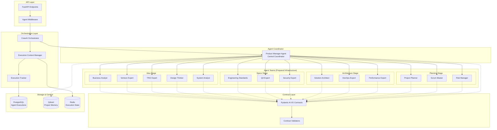
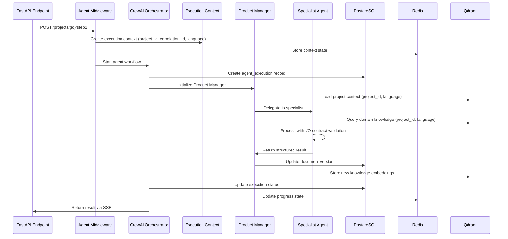

# Story 7: Setup Multi-Agent Framework — Design Document

## 1. Overview

This story establishes the foundational multi-agent architecture using CrewAI 0.186.1+ as the orchestration framework with Pydantic AI 1.0.8+ for strict I/O contracts. The design prepares the system for future Agent Development Kit (ADK) compatibility, enabling potential migration of agents to remote services without protocol changes.

**Key Goals:**

- Implement CrewAI orchestration infrastructure with project isolation
- Define Pydantic AI contracts for all agent types
- Create Product Manager agent as the central coordinator
- Establish agent execution tracking and observability
- Prepare ADK-compatible protocols for future scalability

## 2. Context and Dependencies

**Completed Dependencies:**

- ✅ Story 1: Docker Development Environment
- ✅ Story 2: PostgreSQL Database with project isolation
- ✅ Story 3: Qdrant Vector Database with project+language filtering
- ✅ Story 4: Redis Cache and Queue Service
- ✅ Story 5: Observability Stack with OpenTelemetry
- ⚠️ Story 6: FastAPI Backend Foundation (75% complete, blocker doesn't affect this story)

**Enables:**

- Story 8: Implement Product Manager Agent (full implementation)
- Story 9: Implement LLM-based Language Detection
- Story 10: Implement Idea Stage Agent Team

## 3. Architecture

### 3.1 Multi-Agent Architecture Overview



### 3.2 Agent Execution Flow



## 4. Component Design

### 4.1 CrewAI Orchestrator

**Location:** `backend/app/agents/orchestrator.py`

**Responsibilities:**

- Initialize and manage CrewAI crews for each project stage
- Provide execution context (project_id, correlation_id, language)
- Track agent execution lifecycle
- Handle errors and circuit breakers via Tenacity
- Emit OpenTelemetry traces for all agent operations

**Key Features:**

- Project isolation enforcement at orchestration level
- Language context propagation to all agents
- Execution state management via Redis
- Integration with FastAPI dependency injection

### 4.2 Pydantic AI I/O Contracts

**Location:** `backend/app/agents/contracts/`

**Contract Structure:**

```python
# Base contract for all agents
class AgentInput(BaseModel):
    project_id: UUID  # REQUIRED, never Optional
    correlation_id: UUID
    language: str  # ISO 639-1 code (en, ru, zh, etc.)
    user_message: str
    context: dict[str, Any] = {}

class AgentOutput(BaseModel):
    agent_type: str
    status: str  # "success" | "error" | "needs_input"
    content: str
    metadata: dict[str, Any] = {}
    next_agent: str | None = None

# Stage-specific contracts
class IdeaStageInput(AgentInput):
    previous_answers: list[dict[str, Any]] = []

class IdeaStageOutput(AgentOutput):
    questions: list[dict[str, Any]] = []
    section_text: str = ""
```

**Validation Rules:**

- All inputs MUST include `project_id` (UUID, never Optional)
- All inputs MUST include `language` (ISO code)
- All outputs MUST be validated before returning
- Contract violations raise `ValidationError` (logged and traced)

### 4.3 Execution Context Manager

**Location:** `backend/app/agents/context.py`

**Responsibilities:**

- Create and manage execution context for each agent workflow
- Ensure project_id and language are propagated to all agents
- Store execution state in Redis for progress tracking
- Integrate with correlation ID system from Story 5

**Context Structure:**

```python
class ExecutionContext:
    project_id: UUID  # REQUIRED
    correlation_id: UUID
    language: str
    user_id: UUID
    stage: str  # "idea" | "specs" | "architecture" | "planning"
    state: dict[str, Any]
    created_at: datetime
```

### 4.4 Agent Execution Tracker

**Location:** `backend/app/agents/tracker.py`

**Responsibilities:**

- Record agent executions in PostgreSQL (`agent_executions` table)
- Track status transitions (pending → running → completed/failed)
- Calculate execution duration and performance metrics
- Emit OpenTelemetry metrics for monitoring

**Tracked Data:**

- Agent type and stage
- Input/output data (sanitized)
- Execution duration
- Success/failure status
- Error messages (if any)

### 4.5 ADK Protocol Preparation

**Location:** `backend/app/agents/adk/`

**Purpose:** Prepare infrastructure for future ADK compatibility without implementing full remote agent support in MVP.

**Components:**

```python
# Protocol definitions compatible with Google ADK
class ADKAgentProtocol(Protocol):
    async def execute(self, input: AgentInput) -> AgentOutput:
        """Standard execution interface for all agents"""
        ...

# Future remote agent wrapper (stub for MVP)
class RemoteAgentWrapper:
    """
    Wrapper for future remote agent calls via ADK.
    MVP: All agents are local.
    Post-MVP: Can invoke remote agents without changing contracts.
    """
    async def invoke_remote(self, agent_url: str, input: AgentInput) -> AgentOutput:
        # TODO: Implement ADK remote invocation post-MVP
        raise NotImplementedError("Remote agents not supported in MVP")
```

## 5. Data Models

### 5.1 Agent Executions Table (Enhancement)

**Enhancement to existing schema from Story 2:**

```sql
-- Already exists from Story 2, ensure these fields are present:
CREATE TABLE agent_executions (
    id UUID PRIMARY KEY DEFAULT gen_random_uuid(),
    project_id UUID NOT NULL REFERENCES projects(id) ON DELETE CASCADE,
    agent_type VARCHAR(50) NOT NULL,
    correlation_id UUID NOT NULL,
    input_data JSONB,
    output_data JSONB,
    status VARCHAR(50) NOT NULL DEFAULT 'pending',
    error_message TEXT,
    started_at TIMESTAMP DEFAULT NOW(),
    completed_at TIMESTAMP,
    duration_ms INTEGER,
    
    -- Indexes for performance
    CONSTRAINT agent_executions_pkey PRIMARY KEY (id)
);

CREATE INDEX idx_agent_executions_project ON agent_executions(project_id, started_at DESC);
CREATE INDEX idx_agent_executions_correlation ON agent_executions(correlation_id);
CREATE INDEX idx_agent_executions_status ON agent_executions(status, started_at);
```

### 5.2 Redis Execution State

**Key Pattern:** `agent:execution:{correlation_id}`

**Structure:**

```json
{
  "project_id": "uuid",
  "correlation_id": "uuid",
  "language": "en",
  "stage": "idea",
  "current_agent": "business_analyst",
  "status": "running",
  "progress": 25,
  "started_at": "2025-01-26T10:00:00Z",
  "updated_at": "2025-01-26T10:05:00Z"
}
```

**TTL:** 24 hours (configurable)

## 6. Security and Isolation

### 6.1 Project Isolation

**Enforcement Points:**

1. **Orchestrator Level:** Validate project_id in execution context
2. **Contract Level:** All AgentInput contracts require project_id (never Optional)
3. **Storage Level:** All database queries filtered by project_id
4. **Memory Level:** Qdrant queries include project_id + language filter

### 6.2 Language Isolation

**Enforcement:**

- Language determined at project creation (Story 9)
- Language stored in `projects.language` field
- Language propagated to all agents via ExecutionContext
- All agent prompts and outputs in project language

### 6.3 Error Handling

**Strategy:**

- All agent errors logged with full context
- Errors traced via OpenTelemetry
- User-facing errors sanitized (no internal details)
- Circuit breaker pattern via Tenacity for external LLM calls

## 7. Observability

### 7.1 OpenTelemetry Integration

**Traces:**

- `agent.execution.start` — Agent execution begins
- `agent.execution.complete` — Agent execution ends
- `agent.delegation` — Product Manager delegates to specialist
- `agent.context.load` — Loading context from Qdrant

**Metrics:**

- `agent_execution_duration_ms` — Execution duration by agent type
- `agent_execution_total` — Total executions by status
- `agent_error_rate` — Error rate by agent type

**Attributes:**

- `project_id` (sanitized/hashed for privacy)
- `agent_type`
- `stage`
- `status`
- `language`

### 7.2 Performance Targets

| Metric | Target | Measurement |
|--------|--------|-------------|
| Agent initialization | < 100ms | P95 |
| Context loading | < 200ms | P95 |
| Single agent execution | < 5s | P95 |
| Full stage completion | < 60s | P95 |

## 8. Testing Strategy

### 8.1 Unit Tests

**Coverage:**

- Pydantic AI contract validation
- Execution context creation and propagation
- Agent execution tracker
- Error handling and circuit breakers

**Location:** `backend/tests/unit/test_agents/`

### 8.2 Integration Tests

**Coverage:**

- CrewAI orchestrator with PostgreSQL
- Agent execution flow end-to-end
- Project and language isolation enforcement
- Redis state management

**Location:** `backend/tests/integration/test_agent_orchestration.py`

### 8.3 Contract Tests

**Coverage:**

- All Pydantic AI contract schemas
- Input validation (required fields, types)
- Output validation (structure, completeness)

**Location:** `backend/tests/unit/test_agent_contracts.py`

## 9. Migration and Deployment

### 9.1 Database Migration

**File:** `backend/alembic/versions/007_agent_framework_setup.py`

**Changes:**

- Verify `agent_executions` table exists (from Story 2)
- Add `duration_ms` column if missing
- Create additional indexes for performance

### 9.2 Dependencies

**New packages in `requirements.txt`:**

```txt
crewai>=0.186.1
pydantic-ai>=1.0.8
tenacity>=9.0.0
```

### 9.3 Configuration

**Environment variables (`backend/.env`):**

```bash
# Agent Framework
AGENT_MAX_RETRIES=3
AGENT_RETRY_DELAY_SECONDS=1
AGENT_CIRCUIT_BREAKER_THRESHOLD=5
AGENT_EXECUTION_TIMEOUT_SECONDS=300

# Future ADK support (disabled in MVP)
ADK_REMOTE_AGENTS_ENABLED=false
```

## 10. Future Enhancements (Post-MVP)

### 10.1 ADK Remote Agents

- Implement full ADK protocol for remote agent invocation
- Add service discovery for agent endpoints
- Implement authentication for A2A communication

### 10.2 Agent Performance Optimization

- Implement agent result caching
- Add parallel agent execution where possible
- Optimize context loading with incremental updates

### 10.3 Advanced Orchestration

- Add conditional agent workflows
- Implement agent feedback loops
- Add user interrupt and resume capabilities

## 11. Risk Analysis

| Risk | Probability | Impact | Mitigation |
|------|-------------|--------|------------|
| CrewAI API breaking changes | Low | High | Pin exact version, monitor releases |
| Agent execution timeout | Medium | Medium | Implement circuit breakers, clear error messages |
| Project isolation breach | Low | Critical | Multiple validation layers, comprehensive tests |
| Performance degradation with multiple agents | Medium | Medium | Set execution timeouts, implement queuing |
| Contract validation overhead | Low | Low | Pydantic is optimized, cache schemas |

## 12. Success Criteria

**This story is complete when:**

1. ✅ CrewAI orchestrator integrated and tested
2. ✅ Pydantic AI contracts defined for all agent types
3. ✅ Execution context manager operational
4. ✅ Agent execution tracking persisted to PostgreSQL
5. ✅ Project and language isolation verified
6. ✅ OpenTelemetry traces emitted for all agent operations
7. ✅ Unit and integration tests passing (>90% coverage)
8. ✅ ADK protocol stubs prepared for future compatibility
9. ✅ Documentation complete (this design + API docs)
10. ✅ Basic Product Manager agent skeleton created (full implementation in Story 8)

## 13. Documentation Requirements

**Must deliver:**

- API documentation for agent contracts (OpenAPI)
- Architecture decision record (ADR) for CrewAI selection
- Developer guide for creating new agents
- Troubleshooting guide for common agent errors

## 14. Acceptance Criteria

- [ ] All Pydantic AI contracts validate successfully
- [ ] Agent execution creates records in `agent_executions` table
- [ ] Execution context includes project_id, correlation_id, language
- [ ] All agent operations emit OpenTelemetry traces
- [ ] Error handling prevents agent failures from crashing API
- [ ] Integration tests verify project isolation
- [ ] Documentation covers all public contracts and APIs
- [ ] No FIXME, TODO, or mock implementations in production code paths

