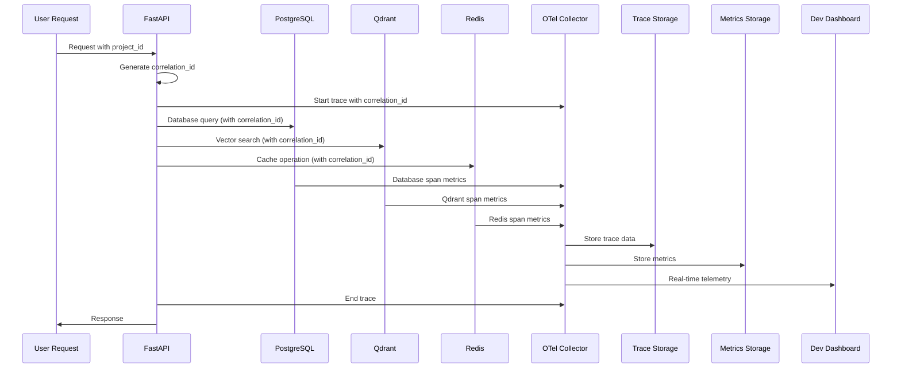
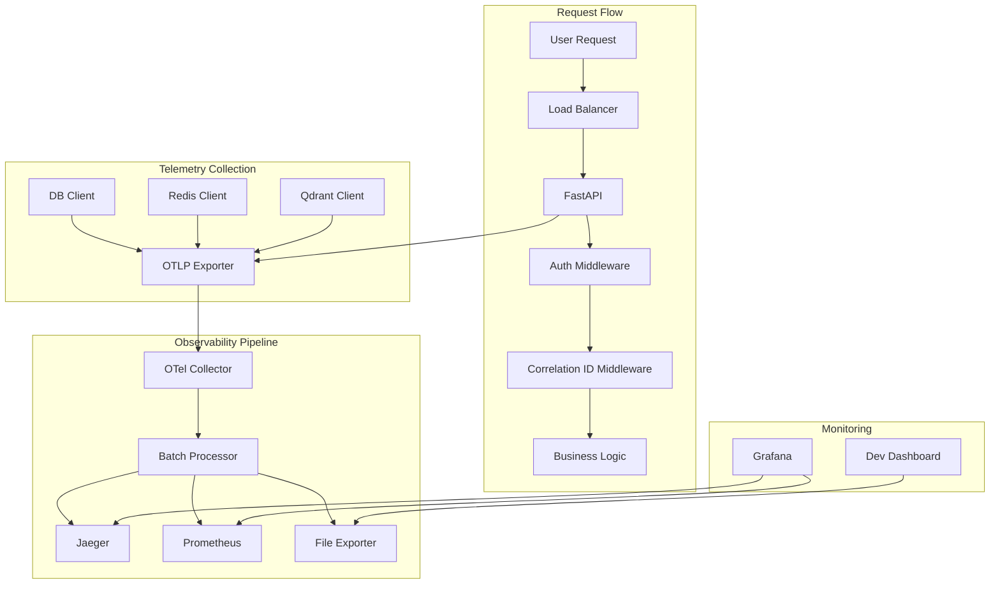

# Design Document — Story "Setup Observability Stack"

## Overview

This story implements comprehensive observability infrastructure for the JEEX Idea system using OpenTelemetry. The observability stack will provide distributed tracing, metrics collection, and structured logging across all services (API, database, vector store, cache) with proper project isolation through correlation IDs.

## Current State Analysis

The project currently has:

- Docker environment with health checks implemented
- PostgreSQL, Redis, Qdrant, and API services running
- Basic container-level health checks via nginx
- No centralized observability or tracing infrastructure
- No correlation ID propagation across services
- No structured logging or metrics collection

## Proposed Architecture

### High-Level Architecture

```mermaid
graph TB
    subgraph "Application Layer"
        API[FastAPI Service<br/>:5210]
        POSTGRES[PostgreSQL<br/>:5220]
        QDRANT[Qdrant<br/>:5230]
        REDIS[Redis<br/>:5240]
    end

    subgraph "Observability Stack"
        COLLECTOR[OpenTelemetry Collector<br/>:4317, :4318, :8888]
        JAEGER[Jaeger (optional)<br/>:16686]
        PROMETHEUS[Prometheus (optional)<br/>:9090]
        GRAFANA[Grafana (optional)<br/>:3000]
    end

    subgraph "Development Dashboard"
        DASH[Dev Dashboard<br/>/otel-dashboard]
    end

    API --> COLLECTOR
    POSTGRES -.-> COLLECTOR
    QDRANT -.-> COLLECTOR
    REDIS -.-> COLLECTOR

    COLLECTOR --> JAEGER
    COLLECTOR --> PROMETHEUS
    COLLECTOR --> DASH

    PROMETHEUS --> GRAFANA
    JAEGER --> GRAFANA
```

### Data Flow Architecture



## Components and Interfaces

### 1. OpenTelemetry Collector Configuration

**Purpose:** Central telemetry collection and export hub

**Key Interfaces:**

- **Receivers:** OTLP gRPC/HTTP, Prometheus metrics, application logs
- **Processors:** Batch processing, resource detection, correlation ID enrichment
- **Exporters:** Jaeger (traces), Prometheus (metrics), file (dev dashboard)

**Configuration Structure:**

```yaml
receivers:
  otlp:
    protocols:
      grpc:
        endpoint: 0.0.0.0:4317
      http:
        endpoint: 0.0.0.0:4318

processors:
  batch:
    timeout: 1s
    send_batch_size: 1024
  resource:
    attributes:
      - key: service.name
        value: "jeex-idea"
      - key: environment
        value: "development"

exporters:
  jaeger:
    endpoint: jaeger:14250
  prometheus:
    endpoint: "0.0.0.0:8889"
  file:
    path: /tmp/telemetry.json
```

### 2. FastAPI OpenTelemetry Integration

**Purpose:** Automatic instrumentation for API service

**Key Components:**

- **Auto-instrumentation:** FastAPI, SQLAlchemy, Redis, HTTP clients
- **Manual instrumentation:** Custom business logic spans
- **Correlation ID propagation:** Request headers and context propagation
- **Project isolation:** Add project_id to all trace attributes

**Integration Points:**

```python
# Middleware for correlation ID
@app.middleware("http")
async def add_correlation_id(request: Request, call_next):
    correlation_id = request.headers.get("x-correlation-id") or str(uuid4())
    context.set_value("correlation_id", correlation_id)
    response = await call_next(request)
    response.headers["x-correlation-id"] = correlation_id
    return response

# Manual span creation
with tracer.start_as_current_span("agent_execution") as span:
    span.set_attribute("project_id", project_id)
    span.set_attribute("agent_type", agent_type)
    # Business logic
```

### 3. Database Instrumentation

**Purpose:** Tracing database operations with project context

**Integration Approach:**

- SQLAlchemy auto-instrumentation
- Query performance monitoring
- Connection pool metrics
- Project isolation tagging

**Trace Attributes:**

- `db.system`: postgresql, redis, qdrant
- `db.operation`: SELECT, INSERT, UPDATE, DELETE
- `db.statement`: SQL query (sanitized)
- `project_id`: Current project context
- `correlation_id`: Request correlation

### 4. Development Dashboard

**Purpose:** Simple web interface for observability during development

**Features:**

- Real-time trace visualization
- Service health status
- Basic metrics charts
- Log aggregation
- Project filtering

**Implementation:**

- Simple FastAPI service on `/otel-dashboard`
- WebSocket updates for real-time data
- Static HTML/JS frontend
- Telemetry data from file exporter

## Data Models

### 1. Trace Data Model

```python
@dataclass
class TraceData:
    trace_id: str
    span_id: str
    parent_span_id: Optional[str]
    operation_name: str
    start_time: datetime
    end_time: datetime
    duration_ms: int
    status: str  # "ok", "error"
    service_name: str
    project_id: Optional[str]
    correlation_id: str
    attributes: Dict[str, Any]
    events: List[Dict[str, Any]]
```

### 2. Metrics Data Model

```python
@dataclass
class MetricData:
    name: str
    value: float
    timestamp: datetime
    labels: Dict[str, str]
    metric_type: str  # "counter", "gauge", "histogram"
    unit: str
```

### 3. Service Health Model

```python
@dataclass
class ServiceHealth:
    service_name: str
    status: str  # "healthy", "degraded", "unhealthy"
    last_check: datetime
    response_time_ms: float
    error_rate: float
    uptime_percentage: float
```

## Error Handling Strategy

### 1. Collector Failures

**Resilience Pattern:**

- Graceful degradation when collector unavailable
- Local buffering of telemetry data
- Retry logic with exponential backoff
- Fallback to file-based storage

**Implementation:**

```python
class ResilientExporter:
    def __init__(self, primary_exporter, fallback_file):
        self.primary = primary_exporter
        self.fallback = fallback_file
        self.buffer = []

    def export(self, batch):
        try:
            self.primary.export(batch)
        except Exception as e:
            logger.warning(f"Primary exporter failed: {e}")
            self.buffer.extend(batch)
            self._write_to_fallback()
```

### 2. Service Isolation

**Isolation Strategy:**

- Observability failures don't affect business logic
- Non-blocking telemetry collection
- Circuit breakers for external services
- Separate process for collector

### 3. Data Quality

**Quality Controls:**

- Trace sampling (1% for high-traffic operations)
- PII filtering in trace attributes
- Metric rate limiting
- Log level filtering

## Architecture Diagrams

### 1. Service Interaction Diagram



### 2. Data Flow with Project Isolation

```mermaid
flowchart TD
    REQUEST[Request: /projects/{id}/step1] --> MIDDLEWARE{Middleware Chain}
    MIDDLEWARE --> CORR[Add correlation_id]
    CORR --> PROJECT[Extract project_id]
    PROJECT --> TRACER[Start trace]

    TRACER --> API_SPAN[API Span]
    API_SPAN --> DB_SPAN[DB Span<br/>project_id={id}]
    API_SPAN --> QDRANT_SPAN[Qdrant Span<br/>project_id={id}]
    API_SPAN --> REDIS_SPAN[Redis Span<br/>project_id={id}]

    DB_SPAN --> COLLECTOR[OTel Collector]
    QDRANT_SPAN --> COLLECTOR
    REDIS_SPAN --> COLLECTOR

    COLLECTOR --> FILTER[Filter by project_id]
    FILTER --> STORE[Store with project context]

    STORE --> DASH[Dashboard<br/>Project filtering]
    STORE --> ALERTS[Alerts<br/>Project-scoped]
```

## Security Considerations

### 1. Sensitive Data Protection

**Data Sanitization:**

- PII detection and redaction in traces
- SQL query sanitization (remove parameters)
- Header filtering for authentication data
- Project-based access control for dashboard

**Implementation:**

```python
class SanitizingProcessor:
    SENSITIVE_HEADERS = {"authorization", "cookie", "x-api-key"}

    def process_span(self, span):
        for attr in span.attributes:
            if self._is_sensitive(attr.key):
                span.attributes[attr.key] = "[REDACTED]"
```

### 2. Access Control

**Dashboard Security:**

- Project-scoped visibility
- Authentication requirement
- Role-based access (owner/editor/viewer)
- Audit logging for dashboard access

### 3. Data Retention

**Retention Policies:**

- Traces: 7 days (development), 30 days (production)
- Metrics: 30 days (development), 90 days (production)
- Logs: 3 days (development), 14 days (production)
- Automatic cleanup with configurable policies

## Performance Considerations

### 1. Overhead Minimization

**Optimization Strategies:**

- Asynchronous telemetry export
- Sampling strategies (trace sampling, metric aggregation)
- Batch processing for exports
- Lightweight serialization

**Performance Targets:**

- < 5% latency overhead for API calls
- < 2% CPU overhead for instrumentation
- < 50MB memory overhead for collector

### 2. Scalability Planning

**Scaling Considerations:**

- Horizontal scaling of collector instances
- Load balancing for trace ingestion
- Partitioned storage by project_id
- Compression of trace data

### 3. Resource Management

**Resource Allocation:**

- Collector: 512MB memory, 0.5 CPU cores
- Jaeger: 1GB memory, 1 CPU core
- Prometheus: 1GB memory, 1 CPU core
- Dashboard: 256MB memory, 0.25 CPU cores

## Implementation Sequence

### Phase 1: Core Infrastructure (Day 1)

1. Set up OpenTelemetry collector configuration
2. Add collector service to docker-compose.yml
3. Implement basic FastAPI instrumentation
4. Set up correlation ID propagation
5. Add health checks for collector

### Phase 2: Service Integration (Day 2)

1. Instrument database operations (PostgreSQL)
2. Add Redis tracing
3. Implement Qdrant instrumentation
4. Create error handling and resilience
5. Add basic metrics collection

### Phase 3: Dashboard and Monitoring (Day 3)

1. Create development dashboard
2. Implement real-time visualization
3. Add project-based filtering
4. Set up alerting rules
5. Document observability practices

## Traceability Matrix

| Requirement | Design Section | Components |
|-------------|----------------|------------|
| REQ-001: Tracing Infrastructure | Proposed Architecture | OpenTelemetry Collector, FastAPI Integration |
| REQ-002: Correlation ID | Components and Interfaces | Correlation ID Middleware, Context Propagation |
| REQ-003: Project Isolation | Data Flow Architecture | Project ID Tagging, Dashboard Filtering |
| REQ-004: Health Monitoring | Error Handling Strategy | Health Checks, Circuit Breakers |
| REQ-005: Development Dashboard | Development Dashboard | Dashboard Service, Real-time Updates |
| REQ-006: Data Security | Security Considerations | Data Sanitization, Access Control |

## Risks & Mitigations

### 1. High Overhead Risk

**Risk:** Observability infrastructure might impact application performance

**Mitigation:**

- Implement comprehensive performance testing
- Use sampling strategies for high-traffic operations
- Provide configuration for different environments
- Monitor observability overhead continuously

### 2. Data Volume Risk

**Risk:** Excessive trace/metric data volume could overwhelm storage

**Mitigation:**

- Implement intelligent sampling
- Use data retention policies
- Compress historical data
- Provide storage monitoring and alerts

### 3. Complexity Risk

**Risk:** Complex observability setup might be hard to maintain

**Mitigation:**

- Start with simple configuration
- Document all setup procedures
- Use managed services where possible
- Provide troubleshooting guides

### 4. Security Risk

**Risk:** Observability data might expose sensitive information

**Mitigation:**

- Implement comprehensive data sanitization
- Review all captured attributes
- Regular security audits
- Access control for dashboard and data

## Success Criteria

1. **All services instrumented** with traces and metrics
2. **Correlation ID propagation** working across all service calls
3. **Project isolation** enforced in all observability data
4. **Development dashboard** accessible and functional
5. **Performance overhead** under 5% for API operations
6. **Health monitoring** with automated alerting
7. **Documentation** for troubleshooting and maintenance

## Dependencies

- Story 1: Docker Development Environment (completed)
- Existing services: FastAPI, PostgreSQL, Redis, Qdrant
- External services: Optional (Jaeger, Prometheus, Grafana)
