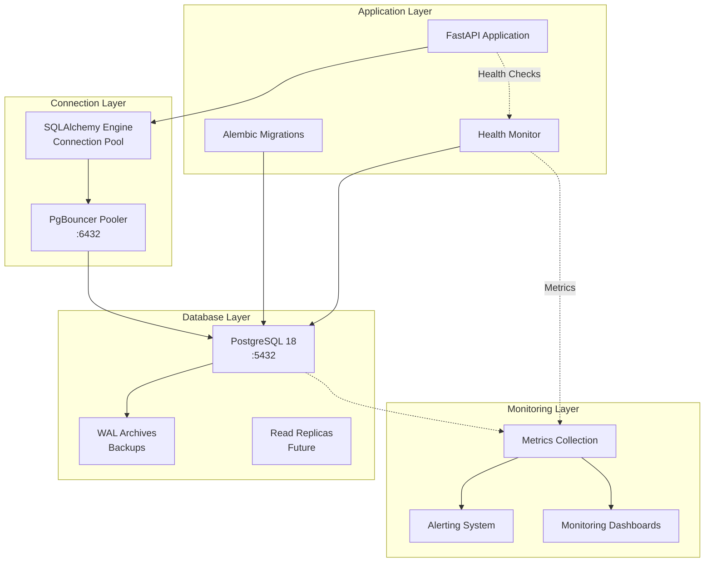
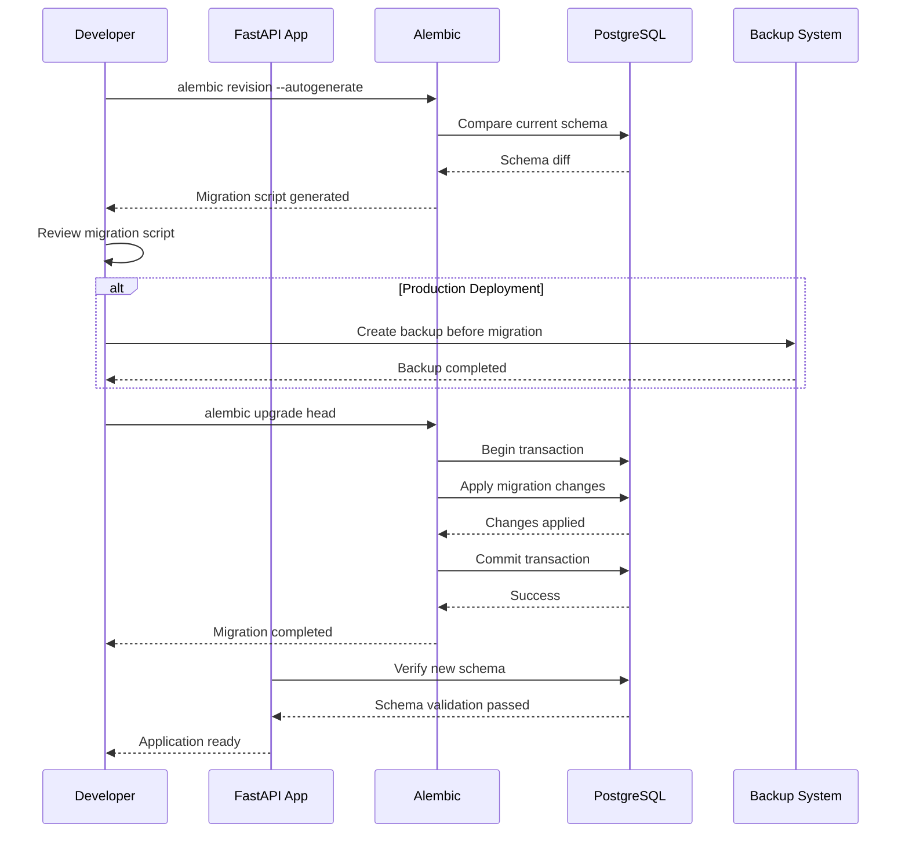
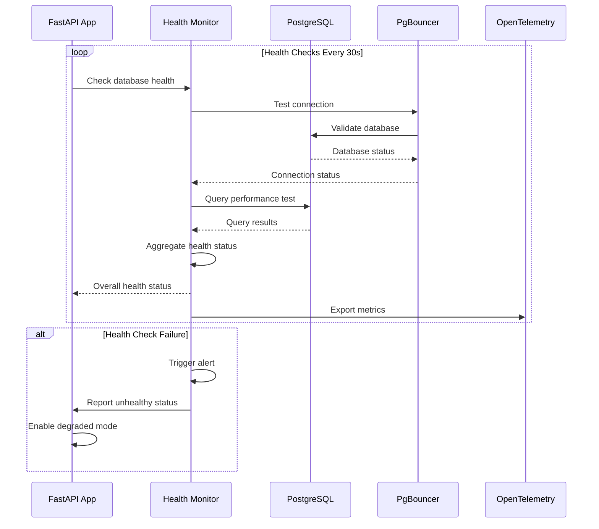

# Design Document — Story "Setup PostgreSQL Database with Migrations"

## Overview

This story establishes the PostgreSQL database foundation for JEEX Idea, implementing the primary data storage system with proper schema, migrations, and connection management. The implementation will create a production-ready PostgreSQL 18 database with UUID v7 support, proper indexing, connection pooling, and comprehensive migration system using Alembic.

The scope includes configuring PostgreSQL 18 with optimal settings for the application, creating initial database schema based on the ER diagrams from architecture specifications, implementing Alembic migration system, setting up connection pooling with PgBouncer, and establishing proper database health checks and monitoring integration.

## Current State Analysis

The Docker development environment from Story 1 provides a basic PostgreSQL 18 container, but lacks:

1. **Database Schema**: No tables, indexes, or constraints have been created
2. **Migration System**: No Alembic configuration or migration scripts exist
3. **Connection Pooling**: Basic PostgreSQL connection without PgBouncer optimization
4. **Database Initialization**: No seed data or initial configuration
5. **Health Monitoring**: Basic container health checks without database-specific monitoring

The current PostgreSQL container is running with default settings and requires proper configuration according to the architectural specifications. All subsequent stories depend on having a functional database with proper schema and migration system.

## Proposed Architecture

### Database Architecture Overview

The PostgreSQL database will serve as the primary data store for JEEX Idea, implementing the complete ER schema defined in the architecture specifications. The database will be configured for high performance with proper indexing, connection pooling, and monitoring integration.

**Key Components:**

- **PostgreSQL 18**: Primary database engine with UUID v7 and AIO support
- **Alembic Migration System**: Database schema versioning and migration management
- **PgBouncer Connection Pooler**: Efficient connection management and pooling
- **Database Health Monitoring**: Custom health checks and metrics collection
- **Backup and Recovery**: Automated backup strategies and point-in-time recovery

### Schema Design

The database will implement the complete schema from architecture specifications:

1. **Users Table**: User authentication and profile management
2. **Projects Table**: Project metadata and language configuration
3. **Document_Versions Table**: Document storage with versioning
4. **Agent_Executions Table**: Agent execution tracking and logging
5. **Exports Table**: Export job management and file tracking

### Connection Management

**PgBouncer Configuration:**

- Transaction pooling mode for optimal performance
- Connection limits and timeout configurations
- Health checks and automatic failover
- Integration with application connection pooling

**Application Connection Strategy:**

- SQLAlchemy async engine with proper connection pooling
- Connection retry logic and circuit breakers
- Database health check integration
- Graceful degradation on connection failures

## Components and Interfaces

### PostgreSQL Database Service

**Responsibilities**: Primary data storage, ACID transactions, data consistency, query optimization

**Configuration**:

- PostgreSQL 18 with UUID v7 extension
- Optimized PostgreSQL settings for application workload
- Database: `jeex_idea`
- User: `jeex_user` with limited privileges
- Connection limits and resource constraints
- WAL settings for backup and recovery

**Interface**: PostgreSQL protocol on port 5432 (internal) and 5220 (external)

### Alembic Migration System

**Responsibilities**: Database schema versioning, migration management, rollback capabilities

**Configuration**:

- Alembic 1.13+ with async support
- Migration environment configuration
- Auto-generation of migration scripts
- Database version tracking
- Migration history and rollback capabilities

**Interface**: Python-based migration scripts with database schema definitions

### PgBouncer Connection Pooler

**Responsibilities**: Connection pooling, load balancing, connection management

**Configuration**:

- PgBouncer with transaction pooling mode
- Maximum connection limits per database
- Connection timeout and idle timeout settings
- Health checks for backend connections
- Statistics and monitoring integration

**Interface**: PostgreSQL-compatible protocol on port 6432

### Database Health Monitor

**Responsibilities**: Database health monitoring, metrics collection, alerting

**Configuration**:

- Custom health check endpoints
- Database metrics collection (connections, queries, performance)
- Integration with OpenTelemetry collector
- Alert thresholds and notifications
- Performance monitoring dashboards

**Interface**: HTTP health endpoints and metrics export

## Data Models

### Database Schema Structure

Based on the architecture ER diagrams, the database will implement these core tables:

```sql
-- Users table for authentication and profile management
CREATE TABLE users (
    id UUID PRIMARY KEY DEFAULT gen_random_uuid(),
    email VARCHAR(255) UNIQUE NOT NULL,
    name VARCHAR(255) NOT NULL,
    profile_data JSONB DEFAULT '{}',
    created_at TIMESTAMP DEFAULT NOW(),
    last_login_at TIMESTAMP,
    updated_at TIMESTAMP DEFAULT NOW()
);

-- Projects table with language and status tracking
CREATE TABLE projects (
    id UUID PRIMARY KEY DEFAULT gen_random_uuid(),
    name VARCHAR(255) NOT NULL,
    status VARCHAR(50) NOT NULL DEFAULT 'draft',
    current_step INTEGER DEFAULT 1 CHECK (current_step BETWEEN 1 AND 4),
    language VARCHAR(10) DEFAULT 'en' NOT NULL,
    created_by UUID REFERENCES users(id),
    created_at TIMESTAMP DEFAULT NOW(),
    updated_at TIMESTAMP DEFAULT NOW()
);

-- Document versions for content management
CREATE TABLE document_versions (
    id UUID PRIMARY KEY DEFAULT gen_random_uuid(),
    project_id UUID REFERENCES projects(id) ON DELETE CASCADE,
    document_type VARCHAR(50) NOT NULL,
    version INTEGER NOT NULL,
    content TEXT NOT NULL,
    metadata JSONB DEFAULT '{}',
    created_by UUID REFERENCES users(id),
    created_at TIMESTAMP DEFAULT NOW()
);

-- Agent execution tracking
CREATE TABLE agent_executions (
    id UUID PRIMARY KEY DEFAULT gen_random_uuid(),
    project_id UUID REFERENCES projects(id) ON DELETE CASCADE,
    agent_type VARCHAR(50) NOT NULL,
    correlation_id UUID NOT NULL,
    input_data JSONB,
    output_data JSONB,
    status VARCHAR(50) NOT NULL DEFAULT 'pending',
    error_message TEXT,
    started_at TIMESTAMP DEFAULT NOW(),
    completed_at TIMESTAMP
);

-- Export management
CREATE TABLE exports (
    id UUID PRIMARY KEY DEFAULT gen_random_uuid(),
    project_id UUID REFERENCES projects(id) ON DELETE CASCADE,
    status VARCHAR(50) NOT NULL DEFAULT 'pending',
    file_path TEXT,
    manifest JSONB DEFAULT '{}',
    created_at TIMESTAMP DEFAULT NOW(),
    expires_at TIMESTAMP DEFAULT (NOW() + INTERVAL '24 hours')
);
```

### Indexing Strategy

```sql
-- Performance indexes for common query patterns
CREATE INDEX idx_projects_created ON projects(created_at DESC);
CREATE INDEX idx_projects_user_status ON projects(created_by, status, updated_at DESC);
CREATE INDEX idx_documents_project_type ON document_versions(project_id, document_type);
CREATE INDEX idx_documents_project_version ON document_versions(project_id, version DESC);
CREATE INDEX idx_executions_project ON agent_executions(project_id, started_at DESC);
CREATE INDEX idx_executions_correlation ON agent_executions(correlation_id);
CREATE INDEX idx_executions_status ON agent_executions(status, started_at);
CREATE INDEX idx_exports_project ON exports(project_id);
CREATE INDEX idx_exports_expires ON exports(expires_at) WHERE status = 'completed';

-- Unique constraints for data integrity
CREATE UNIQUE INDEX idx_documents_unique_version ON document_versions(project_id, document_type, version);
CREATE UNIQUE INDEX idx_users_email ON users(email);
```

### Connection Pool Configuration

```python
# SQLAlchemy async engine configuration
DATABASE_CONFIG = {
    "pool_size": 20,
    "max_overflow": 30,
    "pool_timeout": 30,
    "pool_recycle": 3600,
    "pool_pre_ping": True,
    "echo": False,  # Set to True in development
}

# PgBouncer configuration
PGBOUNCER_CONFIG = {
    "pool_mode": "transaction",
    "max_client_conn": 100,
    "default_pool_size": 20,
    "min_pool_size": 5,
    "reserve_pool_size": 5,
    "reserve_pool_timeout": 5,
    "max_db_connections": 50,
    "max_user_connections": 50,
    "server_reset_query": "DISCARD ALL",
    "ignore_startup_parameters": "extra_float_digits",
}
```

## Error Handling Strategy

### Database Connection Errors

**Connection Pool Exhaustion**:

- Implement connection retry logic with exponential backoff
- Circuit breaker pattern for database unavailability
- Graceful degradation with cached data where possible
- Alert on connection pool metrics

**Database Transaction Errors**:

- Automatic transaction rollback on failures
- Deadlock detection and retry logic
- Constraint violation handling with user-friendly messages
- Data consistency checks and recovery procedures

### Migration Error Handling

**Migration Failures**:

- Automatic rollback on migration failures
- Migration validation before applying changes
- Backup creation before major migrations
- Manual migration override procedures

**Schema Conflicts**:

- Conflict detection and resolution strategies
- Manual intervention procedures for complex conflicts
- Schema validation and consistency checks
- Migration history reconciliation

### Data Integrity Errors

**Constraint Violations**:

- Validation at application level before database operations
- Clear error messages for constraint violations
- Data cleanup and repair procedures
- Audit logging for data integrity issues

**Data Corruption**:

- Regular consistency checks and validation
- Automated repair procedures where possible
- Point-in-time recovery from backups
- Data integrity monitoring and alerting

## Architecture Diagrams

### Database Architecture Overview



### Migration Workflow



### Database Health Monitoring Flow



## Security Considerations

### Database Security

**Access Control**:

- Database users with minimal required privileges
- Application user limited to application database
- Separate admin user for maintenance operations
- Row-level security for sensitive data

**Encryption**:

- TLS encryption for database connections
- Encryption at rest for sensitive data
- Key management for encryption keys
- Secure password storage and rotation

**Network Security**:

- Database access limited to internal networks
- Firewall rules restricting database access
- VPN or SSH tunnel access for admin operations
- Connection IP whitelisting

### Data Protection

**PII Protection**:

- Identification and classification of PII data
- Data masking for non-production environments
- Access logging for sensitive data operations
- Data retention and deletion policies

**Backup Security**:

- Encrypted backups with secure key storage
- Backup access control and auditing
- Secure backup storage and transmission
- Regular backup restoration testing

## Performance Considerations

### Query Optimization

**Index Strategy**:

- Proper indexing for common query patterns
- Composite indexes for multi-column queries
- Partial indexes for filtered queries
- Regular index maintenance and analysis

**Query Performance**:

- Query plan analysis and optimization
- Slow query monitoring and alerting
- Connection pooling optimization
- Query result caching where appropriate

### Resource Management

**Memory Configuration**:

- PostgreSQL memory parameters optimization
- Work_mem and shared_buffers tuning
- Connection memory usage monitoring
- Memory usage alerts and thresholds

**Storage Performance**:

- Proper disk I/O configuration
- Table partitioning for large datasets
- Vacuum and analyze scheduling
- Storage capacity monitoring and planning

### Scalability Planning

**Connection Scaling**:

- PgBouncer connection pool optimization
- Connection limit configuration
- Load balancing for read operations
- Connection reuse strategies

**Database Scaling**:

- Read replica planning for future scaling
- Partitioning strategies for large tables
- Database sharding considerations
- Performance baseline establishment

## Implementation Sequence

### Phase 1: Database Foundation Setup

1. **Configure PostgreSQL 18 with optimal settings**
2. **Create database and user accounts**
3. **Set up PgBouncer connection pooler**
4. **Configure database security and access controls**
5. **Implement database health monitoring**

### Phase 2: Schema Implementation

1. **Set up Alembic migration system**
2. **Create initial database schema migration**
3. **Implement core tables (users, projects, documents)**
4. **Add supporting tables (executions, exports)**
5. **Create indexes and constraints**

### Phase 3: Optimization and Monitoring

1. **Configure connection pooling optimization**
2. **Implement database performance monitoring**
3. **Set up backup and recovery procedures**
4. **Create database maintenance procedures**
5. **Validate database performance and health**

### Phase 4: Integration and Testing

1. **Integrate with FastAPI application**
2. **Test database operations and transactions**
3. **Validate migration rollback procedures**
4. **Test failover and recovery scenarios**
5. **Performance testing and optimization**

## Traceability Matrix

| Design Component | Requirements | Tasks |
|-----------------|-------------|-------|
| PostgreSQL Configuration | DB-001, DB-002 | Task 1.1, 1.2 |
| PgBouncer Setup | DB-003, DB-004 | Task 1.3, 1.4 |
| Alembic Migration System | DB-005, DB-006 | Task 2.1, 2.2 |
| Core Schema Implementation | DB-007, DB-008 | Task 2.3, 2.4 |
| Index and Constraint Setup | DB-009, DB-010 | Task 2.5, 2.6 |
| Database Health Monitoring | DB-011, DB-012 | Task 3.1, 3.2 |
| Backup and Recovery | DB-013, DB-014 | Task 3.3, 3.4 |
| Performance Optimization | DB-015, DB-016 | Task 3.5, 3.6 |

## Risks & Mitigations

### Technical Risks

**Risk**: Database connection exhaustion under load
**Mitigation**: Implement proper connection pooling with PgBouncer, set appropriate connection limits, monitor connection metrics

**Risk**: Migration failures causing data corruption
**Mitigation**: Implement backup before migrations, test migrations in staging, use transactional migrations with rollback capability

**Risk**: Performance degradation with large datasets
**Mitigation**: Implement proper indexing strategy, monitor query performance, plan for read replicas and partitioning

**Risk**: Data loss due to hardware failures
**Mitigation**: Implement regular backups, point-in-time recovery, redundant storage solutions

### Operational Risks

**Risk**: Database security breaches
**Mitigation**: Implement proper access controls, encryption at rest and in transit, regular security audits

**Risk**: Downtime during maintenance operations
**Mitigation**: Plan maintenance windows, implement rolling updates, use read replicas for maintenance operations

**Risk**: Configuration errors in production
**Mitigation**: Infrastructure as code for database configuration, proper change management procedures, configuration validation

### Development Risks

**Risk**: Inconsistent database environments across development stages
**Mitigation**: Containerized database setup, migration-based schema management, environment-specific configurations

**Risk**: Complex migration procedures slowing development
**Mitigation**: Automated migration generation, clear migration procedures, proper documentation

**Risk**: Data model changes breaking existing functionality
**Mitigation**: Backward compatibility considerations, proper migration planning, comprehensive testing procedures
