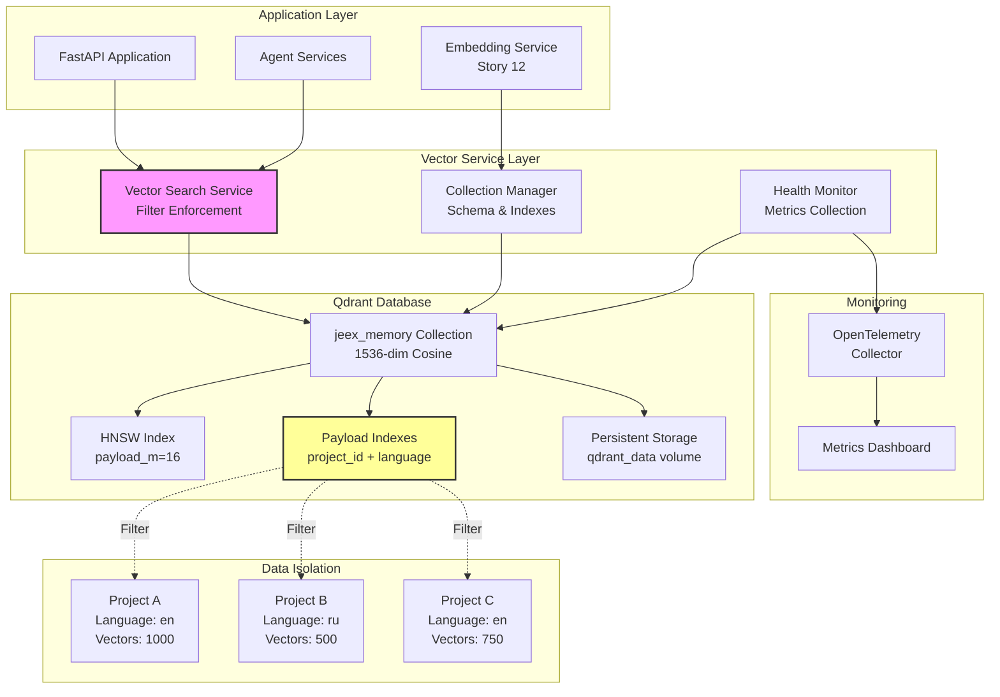
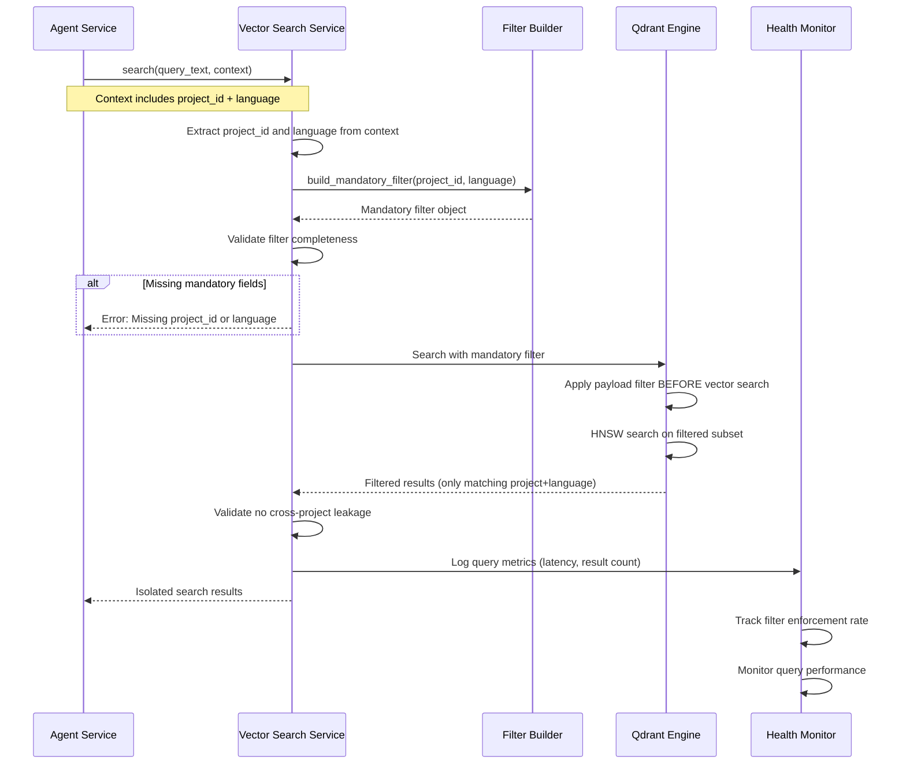
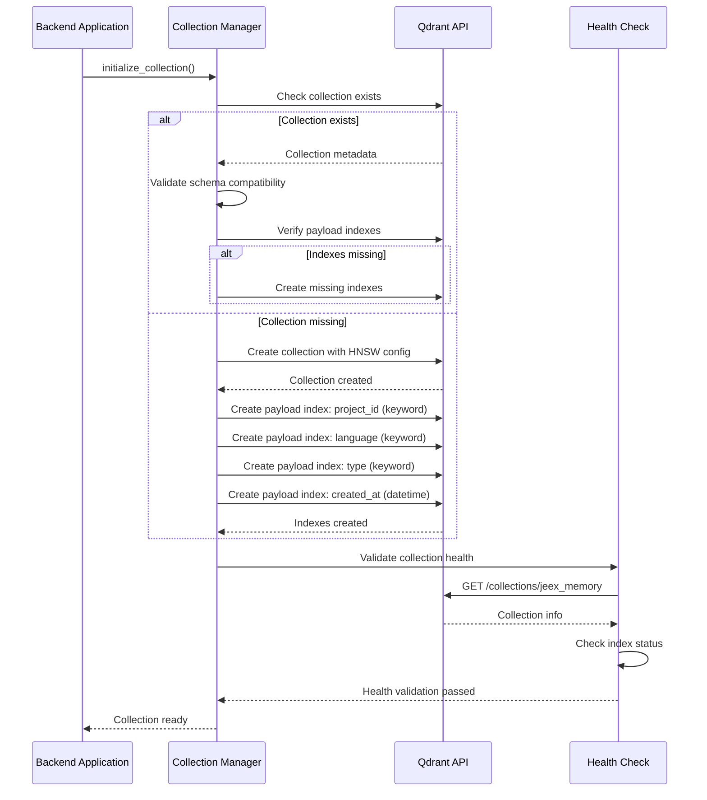

# Design Document — Story "Setup Vector Database (Qdrant)"

## Overview

This story establishes the Qdrant vector database foundation for JEEX Idea, implementing the semantic search and project memory system with strict project and language isolation. The implementation will create a production-ready Qdrant 1.15.4+ instance with optimized multi-tenancy configuration, payload filtering, and comprehensive performance optimization.

The scope includes configuring Qdrant with HNSW indexing optimized for payload filtering, creating a unified collection with mandatory project_id and language filtering, implementing composite payload indexes, establishing health monitoring, and integrating with the existing Docker stack and observability infrastructure.

**Critical architectural requirement**: All vector search operations must be isolated by both project_id AND language at the server side. Language detection is LLM-based only (library/script detection is prohibited). This dual-filter approach ensures that each project's semantic memory is completely isolated and language-specific.

## Current State Analysis

The Docker development environment from Story 1 provides a basic Qdrant 1.15.4 container, but lacks:

1. **Collection Schema**: No collections have been created; default Qdrant instance is unconfigured
2. **Payload Filtering**: No payload indexes or filtering strategies implemented
3. **Project Isolation**: No server-side enforcement of project_id + language filtering
4. **Performance Optimization**: Default HNSW configuration without payload-aware optimization
5. **Health Monitoring**: Basic container health checks without collection-level validation
6. **Integration Layer**: No service abstraction for backend integration

The current Qdrant container is running with default settings on port 5230 (external) mapped to 6333 (internal), with persistent storage via named volume. All subsequent stories requiring semantic search and agent memory depend on having a properly configured vector database with strict isolation guarantees.

## Proposed Architecture

### Vector Database Architecture Overview

Qdrant will serve as the semantic memory layer for JEEX Idea, implementing a single-collection multi-tenant architecture with mandatory dual-field filtering (project_id + language). This approach balances operational simplicity with strict data isolation requirements.

**Key Components:**

- **Qdrant 1.15.4+ Engine**: Vector database with multi-tenancy optimizations and improved payload filtering
- **Single Collection Design**: Unified collection with logical isolation via server-side filters
- **Composite Payload Index**: Optimized index for project_id + language filtering
- **HNSW Configuration**: Payload-aware HNSW settings for filtered search performance
- **Server-Side Filter Enforcement**: Backend middleware ensuring all queries include mandatory filters
- **Health Monitoring**: Collection-level health checks and performance metrics

### Collection Design

**Collection Name**: `jeex_memory`

**Vector Configuration**:

- Vector size: 1536 dimensions (OpenAI text-embedding-3-small for MVP)
- Distance metric: Cosine similarity
- Indexing: HNSW with payload filtering optimization

**Payload Schema**:

```json
{
  "project_id": "uuid-string (mandatory, indexed)",
  "language": "iso-639-1 code (mandatory, indexed)",
  "type": "knowledge | memory | agent_context",
  "visibility": "private | shared",
  "version": "string",
  "document_type": "about | specs | architecture | plan",
  "agent_type": "business_analyst | venture_expert | ...",
  "content_hash": "string (for deduplication)",
  "created_at": "timestamp",
  "metadata": {
    "section": "string",
    "importance": "number",
    "tags": ["array"]
  }
}
```

**Mandatory Filter Pattern**:

```python
# ALL queries MUST include this filter (enforced by backend service layer)
filter = {
    "must": [
        {"key": "project_id", "match": {"value": "<project-uuid>"}},
        {"key": "language", "match": {"value": "<iso-lang-code>"}}
    ]
}
```

### Multi-Tenancy Strategy

Following Qdrant best practices for multi-tenancy (The Tao of Qdrant Multi-tenancy):

1. **Single Collection Approach**: One collection with logical isolation via payload filtering
2. **Composite Index**: Server creates composite index on (project_id, language) for fast filtering
3. **Payload-Aware HNSW**: Configure HNSW with payload_m parameter for optimized filtered search
4. **Data Locality**: Qdrant 1.15.4+ optimizations ensure co-located project data
5. **Server-Side Enforcement**: Backend service NEVER exposes raw Qdrant client to application logic

### Performance Optimization

**HNSW Configuration for Filtered Search**:

```json
{
  "hnsw_config": {
    "m": 0,
    "ef_construct": 100,
    "full_scan_threshold": 10000,
    "max_indexing_threads": 0,
    "on_disk": false,
    "payload_m": 16
  }
}
```

**Key Settings Explained**:

- `m: 0` - Disable standard HNSW graph (rely on payload filtering)
- `payload_m: 16` - Enable payload-aware HNSW indexing
- `ef_construct: 100` - Balance between index quality and build time
- `full_scan_threshold: 10000` - Enable full scan for small result sets

**Quantization** (Future optimization):

- Scalar quantization for memory efficiency
- Binary quantization for extreme performance (if needed)
- Configure per-collection based on embedding model

## Components and Interfaces

### Qdrant Vector Database Service

**Responsibilities**: Vector storage, semantic search, similarity ranking, payload filtering

**Configuration**:

- Qdrant 1.15.4+ with multi-tenancy optimizations
- Collection: `jeex_memory` with 1536-dim vectors
- Storage: Named volume `qdrant_data` for persistence
- Network: `jeex-data` network (data layer isolation)
- Port mapping: 5230 (external) → 6333 (internal HTTP API)
- GRPC port: 6334 (internal, for future performance optimization)

**Interface**: HTTP REST API on port 6333 (internal), exposed as 5230 externally

### Collection Manager Service

**Responsibilities**: Collection lifecycle management, schema validation, index optimization

**Configuration**:

- Collection creation and initialization
- Payload index management (project_id, language composite)
- HNSW configuration optimization
- Collection health validation
- Migration support for schema changes

**Interface**: Python abstraction layer in backend service

### Vector Search Service

**Responsibilities**: Server-side filter enforcement, query optimization, result ranking

**Configuration**:

- Mandatory project_id + language filtering
- Query parameter validation
- Result filtering and deduplication
- Performance monitoring per query
- Circuit breaker for Qdrant failures

**Interface**: Backend API exposing search functionality with automatic filter injection

### Embedding Integration Layer

**Responsibilities**: Vector computation, text preprocessing, deduplication, batch operations

**Configuration**:

- Integration with future embedding service (Story 12)
- Text normalization pipeline
- Content hash computation for deduplication
- Batch upsert optimization
- Embedding quality validation

**Interface**: Async API for embedding storage and retrieval

### Health Monitor

**Responsibilities**: Collection health checks, performance metrics, capacity monitoring

**Configuration**:

- Collection existence validation
- Payload index verification
- Query performance monitoring (P50/P95/P99)
- Storage capacity tracking
- Integration with OpenTelemetry collector

**Interface**: HTTP health endpoints and metrics export

## Data Models

### Vector Point Structure

```python
from qdrant_client.models import PointStruct, VectorParams, Distance

# Vector point with full payload
point = PointStruct(
    id=uuid.uuid4().hex,  # Unique point ID
    vector=[...],  # 1536-dimensional embedding
    payload={
        "project_id": "550e8400-e29b-41d4-a716-446655440000",
        "language": "en",
        "type": "knowledge",
        "visibility": "private",
        "version": "v1",
        "document_type": "about",
        "content_hash": "sha256:...",
        "created_at": "2025-01-15T10:30:00Z",
        "metadata": {
            "section": "problem_statement",
            "importance": 0.9,
            "tags": ["core", "validated"]
        }
    }
)
```

### Collection Configuration

```python
from qdrant_client.models import (
    VectorParams,
    Distance,
    HnswConfigDiff,
    OptimizersConfigDiff,
    PayloadSchemaType,
    CreateCollection
)

# Collection creation parameters
collection_config = CreateCollection(
    vectors=VectorParams(
        size=1536,
        distance=Distance.COSINE,
        hnsw_config=HnswConfigDiff(
            m=0,
            ef_construct=100,
            full_scan_threshold=10000,
            payload_m=16
        )
    ),
    optimizers_config=OptimizersConfigDiff(
        indexing_threshold=20000,
        memmap_threshold=50000
    ),
    replication_factor=1,  # Single node for MVP
    write_consistency_factor=1
)

# Payload indexes for mandatory filtering
payload_indexes = [
    ("project_id", PayloadSchemaType.KEYWORD),
    ("language", PayloadSchemaType.KEYWORD),
    ("type", PayloadSchemaType.KEYWORD),
    ("document_type", PayloadSchemaType.KEYWORD),
    ("created_at", PayloadSchemaType.DATETIME)
]
```

### Filter Construction

```python
from qdrant_client.models import Filter, FieldCondition, MatchValue

def build_mandatory_filter(project_id: str, language: str) -> Filter:
    """
    Construct mandatory filter for ALL queries.
    This function is called server-side; clients cannot bypass it.
    """
    return Filter(
        must=[
            FieldCondition(
                key="project_id",
                match=MatchValue(value=project_id)
            ),
            FieldCondition(
                key="language",
                match=MatchValue(value=language)
            )
        ]
    )

def build_search_filter(
    project_id: str,
    language: str,
    document_types: list[str] | None = None,
    min_importance: float | None = None
) -> Filter:
    """
    Build search filter with mandatory project+language isolation
    plus optional refinements.
    """
    base_filter = build_mandatory_filter(project_id, language)

    if document_types:
        base_filter.should = [
            FieldCondition(
                key="document_type",
                match=MatchValue(value=dtype)
            )
            for dtype in document_types
        ]

    if min_importance:
        base_filter.must.append(
            FieldCondition(
                key="metadata.importance",
                range={"gte": min_importance}
            )
        )

    return base_filter
```

## Error Handling Strategy

### Connection Errors

**Qdrant Service Unavailable**:

- Implement retry logic with exponential backoff (Tenacity)
- Circuit breaker pattern to prevent cascade failures
- Graceful degradation: cache last search results
- Alert on prolonged unavailability
- Health check integration for automatic recovery detection

**Network Timeouts**:

- Configure reasonable timeout values (30s default)
- Distinguish between connection timeout and query timeout
- Implement timeout-specific retry strategies
- Monitor timeout patterns for performance issues

### Query Errors

**Invalid Vector Dimensions**:

- Validate embedding dimensions before upsert
- Reject vectors with incorrect dimensions at service layer
- Log dimension mismatches for debugging
- Alert on systematic dimension errors

**Filter Validation Failures**:

- Validate mandatory filters (project_id, language) at service layer
- Reject queries missing mandatory filters (fail-fast)
- Log filter validation failures for security auditing
- Return clear error messages for client debugging

**Search Performance Degradation**:

- Monitor query latency (P95 < 100ms target)
- Circuit breaker on sustained high latency
- Automatic index optimization triggers
- Alert on performance threshold violations

### Data Integrity Errors

**Duplicate Content Detection**:

- Content hash validation before upsert
- Deduplication strategy: update existing point vs reject
- Track deduplication metrics
- Periodic consistency scans

**Payload Corruption**:

- Payload schema validation on upsert
- Required field validation (project_id, language)
- Type validation for indexed fields
- Audit logging for invalid payloads

**Index Corruption**:

- Periodic index consistency checks
- Automatic index rebuild on corruption detection
- Backup and restore procedures for collection data
- Manual intervention procedures for critical corruption

## Architecture Diagrams

### Qdrant Multi-Tenancy Architecture



### Vector Search Flow with Mandatory Filtering



### Collection Initialization Flow



## Security Considerations

### Data Isolation

**Server-Side Filter Enforcement**:

- ALL queries pass through Vector Search Service layer
- Mandatory filter construction at server side only
- Client applications NEVER directly access Qdrant
- Filter injection attacks prevented by typed API
- Audit logging for all filter construction

**Cross-Project Leakage Prevention**:

- Composite filter (project_id AND language) is non-negotiable
- No query bypasses filter enforcement
- Validation layer checks filter presence
- Periodic audits scanning for filter violations
- Alert on any cross-project result detection

**Language Isolation**:

- Language determined by LLM at project creation (immutable)
- Language stored in PostgreSQL project metadata
- Language passed through secure context (JWT claims or session)
- No client-side language selection for security
- Language filter prevents cross-language contamination

### Access Control

**Authentication Integration**:

- Qdrant API access restricted to backend services only
- Network isolation via Docker networks (jeex-data)
- No direct external access to Qdrant port
- Backend service authentication via internal tokens
- Rate limiting at backend service layer

**Authorization Strategy**:

- Project-level access control in PostgreSQL
- Vector search inherits project authorization
- RBAC (owner/editor/viewer) enforced at API layer
- Read-only operations for viewer role
- Write operations require editor/owner role

### Network Security

**Network Isolation**:

- Qdrant runs on isolated `jeex-data` network
- No direct internet exposure
- Backend-to-Qdrant communication only
- Firewall rules at Docker network layer
- TLS encryption for production deployments

**Port Security**:

- Port 5230 exposed for development/debugging only
- Production: internal-only port 6333
- GRPC port 6334 internal-only
- Health check endpoint restricted to monitoring services

## Performance Considerations

### Query Optimization

**HNSW Parameter Tuning**:

- `payload_m=16`: Optimizes graph for filtered search
- `m=0`: Disables standard HNSW (rely on payload filtering)
- `ef_construct=100`: Balances quality vs build time
- `full_scan_threshold=10000`: Enables efficient small-set filtering

**Search Performance Targets**:

- P50 latency: < 50ms for typical queries
- P95 latency: < 100ms for complex queries
- P99 latency: < 200ms for worst-case scenarios
- Throughput: 100+ queries/second single node

**Index Optimization**:

- Payload indexes on all filter fields
- Composite index coverage for (project_id, language)
- Periodic index rebuild for fragmentation
- Monitor index size and memory usage

### Storage Optimization

**Vector Storage**:

- 1536 dimensions × 4 bytes = 6.14 KB per vector
- Estimated 10,000 vectors per project
- Storage capacity planning: 100MB per project
- Volume monitoring and alerts

**Payload Storage**:

- JSON payload compression
- Indexed field optimization
- Metadata field pruning
- Storage usage tracking per collection

**Disk I/O Optimization**:

- SSD storage for production (required)
- Persistent volume with proper IOPS
- Write-ahead log configuration
- Background indexing to minimize write impact

### Scalability Planning

**Single-Node Limits**:

- Up to 1M vectors per collection (MVP)
- Memory: 4-8GB recommended for 1M vectors
- CPU: 2-4 cores for optimal performance
- Disk: 50-100GB for persistent storage

**Future Scaling Options**:

- Horizontal scaling with sharding (post-MVP)
- Replication for read scalability
- Collection-per-language strategy (if needed)
- Quantization for memory efficiency

## Implementation Sequence

### Phase 1: Qdrant Configuration and Collection Setup

1. **Configure Qdrant service with production-ready settings**
2. **Create jeex_memory collection with HNSW optimization**
3. **Implement payload indexes for project_id and language**
4. **Validate collection health and index status**

### Phase 2: Service Layer Implementation

1. **Implement Collection Manager service**
2. **Implement Vector Search Service with filter enforcement**
3. **Create filter builder and validation logic**
4. **Implement health monitoring and metrics collection**

### Phase 3: Integration and Testing

1. **Integrate with existing Docker stack and health checks**
2. **Create Makefile targets for Qdrant operations**
3. **Implement comprehensive testing suite**
4. **Validate multi-tenancy isolation guarantees**

## Traceability Matrix

| Design Component | Requirements | Tasks |
|-----------------|-------------|-------|
| Qdrant Container Configuration | VDB-001, VDB-002 | Task 1.1, 1.2 |
| Collection Creation with HNSW | VDB-003, VDB-004 | Task 1.3, 1.4 |
| Payload Index Setup | VDB-005, VDB-006 | Task 1.5, 1.6 |
| Filter Enforcement Service | VDB-007, VDB-008 | Task 2.1, 2.2 |
| Collection Manager | VDB-009, VDB-010 | Task 2.3, 2.4 |
| Health Monitoring | VDB-011, VDB-012 | Task 2.5, 2.6 |
| Integration Testing | VDB-013, VDB-014 | Task 3.1, 3.2 |
| Performance Optimization | VDB-015, VDB-016 | Task 3.3, 3.4 |

## Risks & Mitigations

### Technical Risks

**Risk**: Filter bypass allowing cross-project data leakage
**Mitigation**: Server-side filter enforcement only, no direct Qdrant client exposure, automated filter validation, periodic security audits

**Risk**: Performance degradation with large filtered datasets
**Mitigation**: Payload-aware HNSW configuration (payload_m=16), composite indexes, query performance monitoring, index optimization procedures

**Risk**: Collection schema changes breaking existing data
**Mitigation**: Schema versioning, backward compatibility validation, migration procedures, rollback capabilities

**Risk**: Storage capacity exhaustion
**Mitigation**: Storage monitoring and alerts, capacity planning per project, automatic cleanup of old vectors, volume expansion procedures

### Operational Risks

**Risk**: Qdrant service downtime impacting agent functionality
**Mitigation**: Health monitoring with automatic restart, circuit breaker pattern, cached fallback for recent searches, high availability planning for production

**Risk**: Index corruption from unexpected crashes
**Mitigation**: Regular consistency checks, automated index rebuild, persistent storage backups, recovery procedures documented

**Risk**: Memory exhaustion from vector accumulation
**Mitigation**: Memory usage monitoring, vector pruning policies, quantization for memory efficiency, resource limits enforcement

### Development Risks

**Risk**: Complex filter logic causing implementation bugs
**Mitigation**: Comprehensive unit tests for filter construction, integration tests for isolation validation, test fixtures with multi-project data

**Risk**: Integration complexity with embedding service
**Mitigation**: Well-defined interfaces, async API design, batch operation support, error handling at integration boundaries

**Risk**: Performance testing difficulty in development
**Mitigation**: Load testing procedures, performance baseline establishment, realistic test data generation, profiling tools integration
